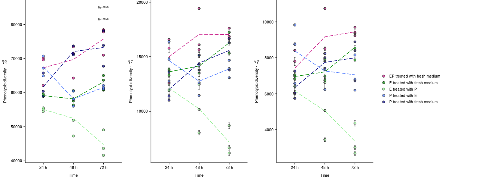

<style>
#TOC {
  margin: 15px 0px 15px 0px;
}
@media (max-width: 768px) {
#TOC {
  position: relative;
  width: 100%;
}
}
.toc-content {
  padding-left: 20px;
  padding-right: 20px;
}
div.tocify {
  width: 20%;
  max-width: 700px;
  max-height: 85%;
}
  body {text-align: justify}
  .main-container {max-width: 2100px !important;}
  code.r{ font-size: 11px; }
  pre{ font-size: 15px }
  pre code, pre, code {
  white-space: pre !important;
  overflow-x: scroll !important;
  word-break: keep-all !important;
  word-wrap: initial !important;
}
</style>


<font size="2">
&#160; &#160; &#160; &#160;<sup>a</sup>  Center for Microbial Ecology and Technology (CMET), Department of Biochemical and Microbial Technology, Ghent University, Coupure Links 653, B-9000 Ghent, Belgium <br>
&#160; &#160;&#160; &#160; <sup>b</sup>  KERMIT, Department of Mathematical Modelling, Statistics and Bioinformatics, Ghent University, Coupure Links 653, B-9000 Ghent, Belgium <br>
&#160; &#160; &#160; &#160; <sup>c</sup>  Group of Nano- and Biophotonics, Department of Molecular Biotechnology, Ghent University, Coupure Links 653, B-9000 Ghent, Belgium
</font>
<br>
<br>
<br>

The full analysis of the submitted paper: _Analysis for Flow cytometric and Raman spectroscopic characterization of bacterial cocultures reveals a taxon-dependent adjustment of individual phenotypic heterogeneities_.

FCM data are available on FlowRepository under accession ID XXX.
Raman data are available ...

All code for the figures presented in the paper can be found below:<br/>
&#160; &#160; &#160; &#160; &bull; <a href="#Figure_2">Figure 2</a> <br/>
&#160; &#160; &#160; &#160; &bull; <a href="#Figure_3">Figure 3</a> <br/>
&#160; &#160; &#160; &#160; &bull; <a href="#Figure_4">Figure 4</a> <br/>
&#160; &#160; &#160; &#160; &bull; <a href="#Figure_5">Figure 5</a> <br/>
&#160; &#160; &#160; &#160; &bull; <a href="#Figure_S2">Figure S2</a> <br/>
&#160; &#160; &#160; &#160; &bull; <a href="#Figure_S4">Figure S4</a> <br/>
&#160; &#160; &#160; &#160; &bull; <a href="#Figure_S5">Figure S5</a> <br/>


# Load libraries


```r
  library("Phenoflow")
  library("vegan")
  library("ggplot2")
  library("RColorBrewer")
  library("ggrepel")
  library("ape")
  library("gridExtra")
  library("grid")
  library("scales")
  library("cowplot")
  library("reshape2")
  library("hyperSpec")
  library("RColorBrewer")
  library("MALDIquant")
  
  set.seed(777)
```

# Phenotypic diversity assessment through flow cytometry

## Load data and metadata


```r
  Datapath <- c("/media/projects1/Jasmine/Cocultures/Data/FCS_metingen")
  fcsfiles <- list.files(path = Datapath, recursive = TRUE, pattern = ".fcs", full.names = TRUE)
  flowData <- flowCore::read.flowSet(files = fcsfiles, transformation = FALSE)
  table <- read.table("/media/projects1/Jasmine/Cocultures/Data/Cocultures_metadata.csv", header = TRUE, sep = ";", stringsAsFactors = FALSE)
```

Samples were analysed on a FACSVerse<sup>TM</sup> flow cytometer, which was equipped with eight fluorescence detectors, two scatter detectors and a blue (488-nm) laser, a red (640-nm) laser and a violet (405-nm) laser. Based on the study of @Rubbens2017B, which assessed the usefulness of information captured by additional detectors (_i.e._ detectors that are not directly targeted) for bacterial population identification, an optimal subset of detectors was selected to include in the analysis. The subset included the scatter-detectors, the detector for which had been stained (_i.e._ `FITC`) and some additional detectors that received spill-over signals. The area-signals were used since the FACSVerse flow cytometer has the highest sensitivity for this signal. In a first step the flow cytometry data is transformed. The arcsine hyperbolic function transforms low values approximately linearly and high values approximately logarithmically. The reason for this transformation is that there is a broad spread in the values of the flow cytometric parameters (_i.e._ scatter and fluorescence). By applying a transformation the variance in the data will be reduced, which will make the following density estimation more accurate.


```r
  # Selected subset of detectors: FSC, SSC, FITC, PerCP-Cy5.5, AmCyan, dsRed and eCFP 
  flowData_transformed <- flowCore::transform(flowData,`FSC-A`=asinh(`FSC-A`),`SSC-A`=asinh(`SSC-A`),`FITC-A`=asinh(`FITC-A`),`PerCP-Cy5.5-A`=asinh(`PerCP-Cy5.5-A`),`AmCyan-A`=asinh(`AmCyan-A`),`dsRed-A`=asinh(`dsRed-A`),`eCFP-A`=asinh(`eCFP-A`))
  param <- c("FSC-A", "SSC-A", "FITC-A", "PerCP-Cy5.5-A", "AmCyan-A", "dsRed-A", "eCFP-A")
  remove(flowData)
```

## Quality control of the dataset

The data quality was evaluated and improperly acquired data was removed using the flowAI package [@Monaco2016]. This package assesses the presence of anomalies related to changes in flow rate, unstable signal or outliers in the lower limit of the dynamic range. Events which were flagged as unreliable were removed from the dataset.


```r
  # Extract parameters not to base denoising on
  param_f <- BiocGenerics::unique(base::gsub(param, pattern = "-H|-A", replacement = ""))
  filter_param <- BiocGenerics::colnames(flowData_transformed)
  filter_param <- BiocGenerics::unique(base::gsub(filter_param, pattern = "-H|-A", replacement = ""))
  filter_param <- filter_param[!filter_param %in% param_f & filter_param!= "Time"]
  filter_param <- c(filter_param, "FSC", "SSC") # Exclude scatter information from denoising

  # Denoise with flowAI
  library("flowAI")
  flowData_transformed <- flowAI::flow_auto_qc(flowData_transformed,
                                  alphaFR = 0.01,
                                  folder_results = "QC_flowAI",
                                  fcs_highQ = "HighQ", # high quality fcs files will have this extension
                                  output = 1,
                                  ChRemoveFS = filter_param, # names  of the channels that are excluded from the signal acquisition check
                                  second_fractionFR = 0.1,
                                  html_report = FALSE,
                                  mini_report = FALSE,
                                  fcs_QC = FALSE,
                                  fcs_lowQ = FALSE
                                  )
```

## Phenotypic diversity estimation

For flow cytometric diversity estimation we followed the previously published protocol by @Props2016, which is available as an R-package <a href="https://github.com/rprops/Phenoflow_package/wiki/1.-Phenotypic-diversity-analysis">here</a>. This package translates the single-cell cytometric data into a phenotypic fingerprint and subsequently calculates alpha and beta diversity from this. These diversity metrics were used as measures for population heterogeneity.  

First, signals that result from instrument noise or abiotic particles, such as crystals or dust, were removed by applying a gate on the primary fluorescence channels (_i.e._ `FITC` and `PerCP-Cy5.5`). 


```r
  # Separate SG and SGPI stained samples 
  flowData_transformed.SG <- methods::new("flowSet")
  flowData_transformed.SGPI <- methods::new("flowSet")
  table.SG <- NULL
  table.SGPI <- NULL
  for(i in 1:dim(table)[1]){
      if(table[i,6] == "SG"){
          flowData_transformed.SG <- methods::rbind2(flowData_transformed.SG, flowData_transformed[i])
          table.SG <- rbind(table.SG,table[i,])
      }
      if(table[i,6] == "SGPI"){
          flowData_transformed.SGPI <- methods::rbind2(flowData_transformed.SGPI, flowData_transformed[i])
          table.SGPI <- rbind(table.SGPI,table[i,])
      }
  }
  
  # Defining the gate
  gate.total <- matrix(c(6.7,6.7,14,11,2.3,4.4,11.5,2.3), ncol = 2, nrow = 4)
  colnames(gate.total) <- c("FITC-A","PerCP-Cy5.5-A")
  polyGate.total <- flowCore::polygonGate(.gate = gate.total, filterId = "Total Cells")
  
  # Select index of the sample to be visualised
  i <- 3
  # Gating quality check for the SG-stained samples
  print(flowViz::xyplot(`PerCP-Cy5.5-A` ~ `FITC-A`, data = flowData_transformed.SG[i], filter = polyGate.total,
         scales = list(y = list(limits = c(0,12)), x = list(limits = c(5,15))),
         nbin = 125, 
         xlab = 'FITC-A', ylab = 'PerCP-Cy5.5-A',
         strip.background = list(col = "white"),
         strip.border = list(col = "white", cex = 5),
         par.strip.text = list(col = "white", font = 0, cex = 0),
         smooth=FALSE
        ))
```


```r
  # Make names for plotting
  staal <- NULL
  split <- base::strsplit(as.character(table.SG$Sample), "_")
  for (i in 1:length(split)){
      staal[i] <- split[[i]][2]
      if(staal[i] == "A"){staal[i] <- "E"}
      else if(staal[i] == "B"){staal[i] <- "P"}
      else(staal[i] <- "EP")
  }
  for (i in 1:length(split)){
      if(table.SG$Treatment[i] == "A"){table.SG$Treatment[i] <- "E"}
      else if(table.SG$Treatment[i] == "B"){table.SG$Treatment[i] <- "P"}
      else if(table.SG$Treatment[i] == "AB"){table.SG$Treatment[i] <- "EP"}
  }
  Names.SG <- paste(staal, "treated with", table.SG$Treatment)
  Names.SG <- as.factor(Names.SG)
```


```r
  # Isolate only the cellular information
  flowData_transformed.SG <- flowCore::Subset(flowData_transformed.SG, polyGate.total)
```

The denoised data is normalized to the [0,1] interval by dividing each parameter by the maximum intensity value of the first fluorescence channel (_i.e._`FITC`) over the data set. The reason for this is to make a bandwidth of 0.01 appropriate during the density estimation.


```r
  # Normalize
  summary <- as.data.frame(flowCore::fsApply(x = flowData_transformed.SG, FUN = function(x) apply(x, 2, max), use.exprs = TRUE))
  max <- max(summary$`FITC-A`)
  mytrans <- function(x) x/max
  flowData_transformed.SG <- flowCore::transform(flowData_transformed.SG,`FSC-A`=mytrans(`FSC-A`),`SSC-A`=mytrans(`SSC-A`),`FITC-A`=mytrans(`FITC-A`),`PerCP-Cy5.5-A`=mytrans(`PerCP-Cy5.5-A`),`AmCyan-A`=mytrans(`AmCyan-A`),`dsRed-A`=mytrans(`dsRed-A`),`eCFP-A`=mytrans(`eCFP-A`))
```

The data of all populations is subsampled in order to account for sample size differences. The reason for this is that differences in sample size can influence the diversity estimation (see <https://github.com/rprops/Phenoflow_package/wiki/2.-Effect-of-sample-size> for more information). Cells were randomly selected for each sample (with replacement).


```r
  flowData_transformed30000 <- Phenoflow::FCS_resample(flowData_transformed.SG, 30000)
```

For calculating the phenotypic fingerprint, a discretization step is performed by applying a 128x128 binning grid. This grid is applied for each of the binary parameter combinations. During the discretization step the operational phenotypes (bins) are defined. In each of the bins a Gaussian distribution is fitted by a Kernel density estimation. Finally, all density estimations are summed, leading to the density estimation of the population. The density values for all bins are then concatenated into a 1D-vector, which is called the 'phenotypic fingerprint'. This phenotypic fingerprint has a structure similar to the output of sequencing pipelines.


```r
  library("flowCore")
  fbasis <- flowFDA::flowBasis(flowData_transformed30000, param, nbin = 128, bw = 0.01, normalize = function(x) x)
```

### Alpha-diversity

To evaluate alpha-diversity (_i.e._ within sample diversity) the first three Hill numbers are calculated: _D<sub>0</sub>_ (richness), _D<sub>1</sub>_ (the exponential of Shannon entropy) and _D<sub>2</sub>_ (the inverse of Simpsons index). The larger the Hill order, the lesser rare species (in this case rare 'phenotypic bins') are taken into account.


```r
  # Diversity estimation
  Diversity.clean <- Phenoflow::Diversity_rf(flowData_transformed30000, param = param, R = 100, R.b = 100, cleanFCS = FALSE) # cleaning was already performed before
  # Add metadata to the results for plotting
  Diversity.total <- cbind(Diversity.clean, table.SG$Time, Names.SG)
  colnames(Diversity.total) <- c("Sample_name","D0","D1","D2","sd.D0","sd.D1","sd.D2","Time","Samples")
  # Calculate average diversities for trend lines
  Average.Diversities <- NULL
  for (i in seq(1, 45, by = 3)){
      info <- cbind(as.character(Diversity.total$Time[i]), as.character(Diversity.total$Samples[i]))
      colnames(info)
      k = i+2
      Average.D0 <- mean(Diversity.total$D0[i:k])
      Average.D1 <- mean(Diversity.total$D1[i:k])
      Average.D2 <- mean(Diversity.total$D2[i:k])
      Averages <- cbind.data.frame(info, Average.D0, Average.D1, Average.D2)
      Average.Diversities <- rbind.data.frame(Average.Diversities, Averages)
  }
  colnames(Average.Diversities)[1:2] <- c("Time","Samples")
```


```r
  # Plot diversity dynamics
  plot.D0 <- ggplot2::ggplot(Diversity.total, ggplot2::aes(x = Time, y = D0, fill = Samples, group = Samples)) +
              ggplot2::geom_point(shape = 21, size = 2, alpha = 0.7) +
              ggplot2::labs(x = "Time", y = expression('Phenotypic diversity - D'[0]^"p")) +
              ggplot2::scale_fill_manual("", values = c("mediumvioletred","green4","lightgreen","royalblue1","navy")) +
              ggplot2::geom_line(data=Average.Diversities, ggplot2::aes(x = Time, y = Average.D0, color = Samples), alpha = 1, linetype = 5, show.legend = F) +
              ggplot2::scale_color_manual(values = c("lightgreen","green4","mediumvioletred","royalblue1","navy")) +
              cowplot::theme_cowplot() +
              ggplot2::theme(plot.margin = unit(c(0,0.3,0,0), "cm"), legend.key.height=unit(0.9,"line"), legend.margin = margin(-0.5,0,0,0.2, unit="cm"), legend.text=element_text(size=7.5), text = element_text(size=8),  axis.text.x = element_text(size=8), axis.text.y = element_text(size=8))
  AlphaDiv.legend <- cowplot::get_legend(plot.D0)
  plot.D0 <- plot.D0 + ggplot2::theme(legend.position = "none")
  plot.D1 <- ggplot2::ggplot(Diversity.total, ggplot2::aes(x = Time, y = D1, fill = Samples, group = Samples)) +
              ggplot2::geom_point(shape = 21, size = 2, alpha = 0.7) +
              ggplot2::geom_errorbar(ggplot2::aes(ymin = D1-sd.D1, ymax = D1+sd.D1), color = "gray25", width = 0.050) +
              ggplot2::labs(x = "Time", y = expression('Phenotypic diversity - D'[1]^"p")) +
              ggplot2::scale_fill_manual("", values = c("mediumvioletred","green4","lightgreen","royalblue1","navy")) +
              ggplot2::geom_line(data = Average.Diversities, ggplot2::aes(x = Time, y = Average.D1, color = Samples), alpha = 1, linetype = 5, show.legend = F) +
              ggplot2::scale_color_manual(values = c("lightgreen","green4","mediumvioletred","royalblue1","navy")) +
              cowplot::theme_cowplot() + 
              ggplot2::theme(legend.position = "none", plot.margin = unit(c(0,0.3,0,0), "cm"), legend.key.height=unit(0.9,"line"), legend.margin = margin(-0.5,0,0,0.2, unit="cm"), legend.text=element_text(size=7.5), text = element_text(size=8),  axis.text.x = element_text(size=8), axis.text.y = element_text(size=8))
  plot.D2 <- ggplot2::ggplot(Diversity.total, ggplot2::aes(x = Time, y = D2, fill = Samples, group = Samples)) +
              ggplot2::geom_point(shape = 21, size = 2, alpha = 0.7) +
              ggplot2::geom_errorbar(ggplot2::aes(ymin = D2-sd.D2, ymax =  D2+sd.D2), color = "gray25", width = 0.050) +
              ggplot2::labs(x = "Time", y = expression('Phenotypic diversity - D'[2]^"p")) +
              ggplot2::scale_fill_manual("", values = c("mediumvioletred","green4","lightgreen","royalblue1","navy")) +
              ggplot2::geom_line(data = Average.Diversities, ggplot2::aes(x = Time ,y = Average.D2, color = Samples), alpha = 1, linetype = 5, show.legend = F) +
              ggplot2::scale_color_manual(values = c("lightgreen","green4","mediumvioletred","royalblue1","navy")) +
              cowplot::theme_cowplot() + 
              ggplot2::theme(legend.position = "none", plot.margin = unit(c(0,0.3,0,0), "cm"), legend.key.height=unit(0.9,"line"), legend.margin = margin(-0.5,0,0,0.2, unit="cm"), legend.text=element_text(size=7.5), text = element_text(size=8),  axis.text.x = element_text(size=8), axis.text.y = element_text(size=8))
  p <- cowplot::plot_grid(plot.D0, plot.D1, plot.D2, AlphaDiv.legend, ncol = 4, nrow = 1)
  print(p)
```




<a name="Figure_S2"></a> 

Results for _D<sub>0</sub>_ and _D<sub>1</sub>_ are highly correlated with _D<sub>2</sub>_, and were therefore only included in the supplementary information.


```r
  # Pearson correlations
  cor(Diversity.total$D0,Diversity.total$D2)
  cor(Diversity.total$D1,Diversity.total$D2)
  cor(Diversity.total$D0,Diversity.total$D1)
```

```
## [1] 0.8862249
## [1] 0.9794648
## [1] 0.9098481
```


```r
  # Assemble Figure S2
  p <- cowplot::plot_grid(plot.D0, plot.D1, AlphaDiv.legend, ncol = 3, nrow = 1)
  print(p)
```


### Beta-diversity

Beta-diversity (_i.e._ between sample diversity) was evaluated using the Bray-Curtis dissimilarity. This metric is widely used in ecology for comparison of species abundance data. It takes a value of zero in case of two identical samples, and a value of one in case of two samples which have no species ('phenotypic bins' in this case) in common. The Bray-Curtis dissimilarities of the dataset were visualised by principal coordinate analysis (PCoA). The aim of PCoA is to construct a plot in a low-dimensional (2- or 3D) space while respecting the dissimilarities between the data points as well as possible. This way the dissimilarity matrix can easily be interpreted though the ordination: points that are further away are more distinct, points that are closer to each other are more similar.


```r
  # Beta-diversity assessment
  beta_div <- Phenoflow::beta_div_fcm(fbasis, ord.type="PCoA")
  # Add metadata to the results for plotting
  beta.pcoa <- as.data.frame(beta_div$points)
  beta.pcoa <- cbind(beta.pcoa, as.factor(table.SG$Time), Names.SG)
  colnames(beta.pcoa) <- c('Axis1', 'Axis2', 'Time', 'Samples')
  var <- base::format(round(vegan::eigenvals(beta_div)/sum(vegan::eigenvals(beta_div))*100,1), nsmall = 1)
  factor.symbol <- as.factor(paste(beta.pcoa$Samples, ",", beta.pcoa$Time))
  beta.pcoa <- cbind(beta.pcoa, factor.symbol)
```


```r
  PCoA.plot <- ggplot2::ggplot(beta.pcoa, ggplot2::aes(x = Axis1, y = Axis2, fill = Samples, shape = Time)) +
                ggplot2::geom_point(alpha = 0.9, size = 4, stroke = 1)+
                ggplot2::theme(legend.position = "right", plot.margin = unit(c(0,0,0,0), "mm")) +
                ggplot2::labs(x = paste0("PCoA Axis 1 (",var[1], "%)"), y = paste0("PCoA Axis 2 (",var[2], "%)")) +
                ggplot2::scale_fill_manual("", values = c("mediumvioletred","lightgreen","green4","royalblue1","navy")) +
                ggplot2::scale_shape_manual("", values = c(21, 24, 22)) +
                ggplot2::guides(fill = ggplot2::guide_legend(override.aes = list(shape = 21))) +
                ggplot2::coord_fixed(ratio = 1) +
                ggplot2::scale_x_continuous(breaks = round(base::seq(min(beta.pcoa$Axis1), max(beta.pcoa$Axis1), by = 0.2),1), lim = c(min(beta.pcoa$Axis1)-0.05, max(beta.pcoa$Axis1)+0.05)) +
                ggplot2::scale_y_continuous(breaks = round(base::seq(min(beta.pcoa$Axis2), max(beta.pcoa$Axis2), by = 0.2),1), lim = c(min(beta.pcoa$Axis2)-0.05, max(beta.pcoa$Axis2)+0.05)) +
                cowplot::theme_cowplot()
  print(PCoA.plot)
```


<a name="Figure_2"></a> 
<!--<font size="4"><span style="color:#e62e00"><b>Figure 2</b></span></font>-->


```r
  # Split according to time
  beta.pcoa$Plot24 <- as.factor(as.character(beta.pcoa$Time) == "24 h")
  beta.pcoa$Plot48 <- as.factor(as.character(beta.pcoa$Time) == "48 h")
  beta.pcoa$Plot72 <- as.factor(as.character(beta.pcoa$Time) == "72 h")
  
  PCoA.plot1 <- ggplot2::ggplot(beta.pcoa, ggplot2::aes(x = Axis1, y = Axis2, fill = Samples, shape = Time, alpha = Plot24)) +
                ggplot2::geom_point(size = 2.5, stroke = 0.5) +
                ggplot2::labs(x = paste0("PCoA Axis 1 (",var[1], "%)"), y = paste0("PCoA Axis 2 (",var[2], "%)")) +
                ggplot2::scale_fill_manual("", values = c("mediumvioletred","lightgreen","green4","royalblue1","navy")) +
                ggplot2::scale_shape_manual("", values = c(21,24,22)) +
                ggplot2::scale_alpha_manual("", values = c(0.15,1), guide = FALSE) +
                ggplot2::guides(fill= ggplot2::guide_legend(override.aes = list(shape = 21))) +
                ggplot2::coord_fixed(ratio = 1) +
                ggplot2::ggtitle("24h") +
                ggplot2::scale_x_continuous(breaks = round(base::seq(min(beta.pcoa$Axis1), max(beta.pcoa$Axis1), by = 0.2),1), lim = c(min(beta.pcoa$Axis1)-0.05, max(beta.pcoa$Axis1)+0.05)) +
                ggplot2::scale_y_continuous(breaks = round(base::seq(min(beta.pcoa$Axis2), max(beta.pcoa$Axis2), by = 0.2),1), lim = c(min(beta.pcoa$Axis2)-0.05, max(beta.pcoa$Axis2)+0.05)) +
                cowplot::theme_cowplot() +
                ggplot2::theme(plot.margin = unit(c(0,0.3,0,0), "cm"), legend.key.height=unit(0.9,"line"), legend.margin = margin(-0.5,0,0,0.2, unit="cm"), legend.text=element_text(size=7.5), text = element_text(size=8),  axis.text.x = element_text(size=8), axis.text.y = element_text(size=8), plot.title = element_text(size=9, hjust = -0.6))
  PCoA.legend <- cowplot::get_legend(PCoA.plot1)
  PCoA.plot1 <- PCoA.plot1 + ggplot2::theme(legend.position = "none")
  PCoA.plot2 <- ggplot2::ggplot(beta.pcoa, ggplot2::aes(x = Axis1, y = Axis2, fill = Samples, shape = Time, alpha = Plot48))  +
                ggplot2::geom_point(size = 2.5, stroke = 0.5) +
                ggplot2::labs(x = paste0("PCoA Axis 1 (",var[1], "%)"), y = paste0("PCoA Axis 2 (",var[2], "%)")) +
                ggplot2::scale_fill_manual("", values = c("mediumvioletred","lightgreen","green4","royalblue1","navy")) +
                ggplot2::scale_shape_manual("", values = c(21,24,22)) +
                ggplot2::scale_alpha_manual("", values = c(0.15,1)) +
                ggplot2::guides(fill = ggplot2::guide_legend(override.aes = list(shape = 21))) +
                ggplot2::coord_fixed(ratio = 1) +
                ggplot2::ggtitle("48h") +
                ggplot2::scale_x_continuous(breaks = round(base::seq(min(beta.pcoa$Axis1), max(beta.pcoa$Axis1), by = 0.2),1), lim = c(min(beta.pcoa$Axis1)-0.05, max(beta.pcoa$Axis1)+0.05)) +
                ggplot2::scale_y_continuous(breaks = round(base::seq(min(beta.pcoa$Axis2), max(beta.pcoa$Axis2), by = 0.2),1), lim = c(min(beta.pcoa$Axis2)-0.05, max(beta.pcoa$Axis2)+0.05)) +
                cowplot::theme_cowplot() +
                ggplot2::theme(legend.position = "none", plot.margin = unit(c(0,0.3,0,0), "cm"), text = element_text(size=8),  axis.text.x = element_text(size=8), axis.text.y = element_text(size=8), plot.title = element_text(size=9, hjust = -0.6))
  PCoA.plot3 <- ggplot2::ggplot(beta.pcoa, ggplot2::aes(x = Axis1, y = Axis2, fill = Samples, shape = Time, alpha = Plot72)) +
                ggplot2::geom_point(size = 2.5, stroke = 0.5) +
                ggplot2::labs(x = paste0("PCoA Axis 1 (",var[1], "%)"), y = paste0("PCoA Axis 2 (",var[2], "%)")) +
                ggplot2::scale_fill_manual("", values=c("mediumvioletred","lightgreen","green4","royalblue1","navy")) +
                ggplot2::scale_shape_manual("", values = c(21,24,22)) +
                ggplot2::scale_alpha_manual("", values = c(0.15,1)) +
                ggplot2::guides(fill=ggplot2::guide_legend(override.aes = list(shape = 21))) +
                ggplot2::coord_fixed(ratio = 1) +
                ggplot2::ggtitle("72h") +
                ggplot2::scale_x_continuous(breaks = round(base::seq(min(beta.pcoa$Axis1), max(beta.pcoa$Axis1), by = 0.2),1), lim = c(min(beta.pcoa$Axis1)-0.05, max(beta.pcoa$Axis1)+0.05)) +
                ggplot2::scale_y_continuous(breaks = round(base::seq(min(beta.pcoa$Axis2), max(beta.pcoa$Axis2), by = 0.2),1), lim = c(min(beta.pcoa$Axis2)-0.05, max(beta.pcoa$Axis2)+0.05)) +
                cowplot::theme_cowplot() +
                ggplot2::theme(legend.position = "none", plot.margin = unit(c(0,0.3,0,0), "cm"), text = element_text(size=8),  axis.text.x = element_text(size=8), axis.text.y = element_text(size=8), plot.title = element_text(size=9, hjust = -0.6))
  p <- cowplot::plot_grid(PCoA.plot1, PCoA.plot2, PCoA.plot3, PCoA.legend, ncol = 4, nrow = 1)
  print(p)
```


Statistical significance of the differences between the samples was assessed using PERMANOVA. This is a non-parametric test to analyse variance for multivariate data.


```r
  # Bray-Curtis
  BrayCurtis <- vegan::vegdist(fbasis@basis, method = "bray")
  
  # Check homogeneity of group dispersions
  # Between all of the seperate groups (time and population)
  Diversity.total$Groups <- paste(Diversity.total$Time, Diversity.total$Samples)
  betadisper <- vegan::betadisper(BrayCurtis, group = Diversity.total$Groups)
  # Over time
  betadisper <- vegan::betadisper(BrayCurtis, group = Diversity.total$Time)
  # Between populations (5 different groups 'AB', A/B', 'A/fresh' and 'B/fresh')
  betadisper <- vegan::betadisper(BrayCurtis, group = Diversity.total$Samples)
  # Between populations (different treatments of A: 'treated with fresh' and 'treated with B')
  BrayCurtisSubset <- vegan::vegdist(fbasis@basis[(table.SG$Pres_A == "YES") & (table.SG$Pres_B == "NO"),], method = "bray")
  GroupsA <- Diversity.total$Samples[(table.SG$Pres_A == "YES") & (table.SG$Pres_B == "NO")]
  betadisper <- vegan::betadisper(BrayCurtisSubset, group = GroupsA)
  # Between populations (different treatments of B: 'treated with fresh' and 'treated with A')
  BrayCurtisSubset <- vegan::vegdist(fbasis@basis[(table.SG$Pres_A == "NO") & (table.SG$Pres_B == "YES"),], method = "bray")
  GroupsB <- Diversity.total$Samples[(table.SG$Pres_A == "NO") & (table.SG$Pres_B == "YES")]
  betadisper <- vegan::betadisper(BrayCurtisSubset, group = GroupsB)
  
  # Permanova
  # Between all of the seperate groups (effect of time and population)
  BrayCurtis <- vegan::vegdist(fbasis@basis, method="bray")
  permanova <- vegan::adonis(BrayCurtis ~ Time * Samples, data = Diversity.total, permutations = permute::how(nperm = 999))
  permanova
```

```
## 
## Call:
## vegan::adonis(formula = BrayCurtis ~ Time * Samples, data = Diversity.total,      permutations = permute::how(nperm = 999)) 
## 
## Permutation: free
## Number of permutations: 999
## 
## Terms added sequentially (first to last)
## 
##              Df SumsOfSqs MeanSqs F.Model      R2 Pr(>F)    
## Time          2    1.0609 0.53046  20.319 0.15089  0.001 ***
## Samples       4    3.4686 0.86716  33.216 0.49332  0.001 ***
## Time:Samples  8    1.7184 0.21480   8.228 0.24440  0.001 ***
## Residuals    30    0.7832 0.02611         0.11139           
## Total        44    7.0311                 1.00000           
## ---
## Signif. codes:  0 '***' 0.001 '**' 0.01 '*' 0.05 '.' 0.1 ' ' 1
```

```r
  # Between populations (different treatments of A: 'treated with fresh' and 'treated with B')
  BrayCurtisSubsetA <- vegan::vegdist(fbasis@basis[(table.SG$Pres_A == "YES") & (table.SG$Pres_B == "NO"),],  method = "bray")
  permanovaA <- vegan::adonis(BrayCurtisSubsetA ~ GroupsA, data = as.data.frame(GroupsA), permutations = permute::how(nperm = 999))
  permanovaA
```

```
## 
## Call:
## vegan::adonis(formula = BrayCurtisSubsetA ~ GroupsA, data = as.data.frame(GroupsA),      permutations = permute::how(nperm = 999)) 
## 
## Permutation: free
## Number of permutations: 999
## 
## Terms added sequentially (first to last)
## 
##           Df SumsOfSqs MeanSqs F.Model      R2 Pr(>F)    
## GroupsA    1    1.3583 1.35829  15.712 0.49546  0.001 ***
## Residuals 16    1.3832 0.08645         0.50454           
## Total     17    2.7415                 1.00000           
## ---
## Signif. codes:  0 '***' 0.001 '**' 0.01 '*' 0.05 '.' 0.1 ' ' 1
```

```r
  # Between populations (different treatments of B: 'treated with fresh' and 'treated with A')
  BrayCurtisSubsetB <- vegan::vegdist(fbasis@basis[(table.SG$Pres_A == "NO") & (table.SG$Pres_B == "YES"),],  method = "bray")
  permanovaB <- vegan::adonis(BrayCurtisSubsetB ~ GroupsB, data = as.data.frame(GroupsB), permutations = permute::how(nperm = 999))
  permanovaB
```

```
## 
## Call:
## vegan::adonis(formula = BrayCurtisSubsetB ~ GroupsB, data = as.data.frame(GroupsB),      permutations = permute::how(nperm = 999)) 
## 
## Permutation: free
## Number of permutations: 999
## 
## Terms added sequentially (first to last)
## 
##           Df SumsOfSqs MeanSqs F.Model      R2 Pr(>F)
## GroupsB    1   0.18894 0.18894  1.8477 0.10353  0.138
## Residuals 16   1.63611 0.10226         0.89647       
## Total     17   1.82505                 1.00000
```

## Contrast analysis

Using contrast analysis, differences between the phenotypic fingerprints of populations can be easily visualised in bivariate parameter spaces. Contrasts were used to compare the phenotypic community structure of axenic cultures and coculture members. Each of the plots below is a comparison between the axenic culture and coculture of the same taxon at the same time point, averaged over the three biological replicates. The colour gradient indicates whether density in the coculture increased (purple) or decreased (dark green) relative to their respective axenic culture at the specified time point. Note that for the different taxa and the different parameters (_i.e._ scatters or fluorescence) other colour scales have been used.


```r
# Contrast analysis : fluorescence parameters
comp_A_t0 <- Phenoflow::fp_contrasts(fbasis, comp1 = c(1:3), comp2 = c(4:6), param = c("FITC-A","PerCP-Cy5.5-A"), thresh = 0.01)
comp_A_t1 <- Phenoflow::fp_contrasts(fbasis, comp1 = c(16:18), comp2 = c(19:21), param = c("FITC-A","PerCP-Cy5.5-A"), thresh = 0.01)
comp_A_t2 <- Phenoflow::fp_contrasts(fbasis, comp1 = c(31:33), comp2 = c(34:36), param = c("FITC-A","PerCP-Cy5.5-A"), thresh = 0.01)
comp_B_t0 <- Phenoflow::fp_contrasts(fbasis, comp1 = c(10:12), comp2 = c(13:15), param = c("FITC-A","PerCP-Cy5.5-A"), thresh = 0.01)
comp_B_t1 <- Phenoflow::fp_contrasts(fbasis, comp1 = c(25:27), comp2 = c(28:31), param = c("FITC-A","PerCP-Cy5.5-A"), thresh = 0.01)
comp_B_t2 <- Phenoflow::fp_contrasts(fbasis, comp1 = c(40:42), comp2 = c(43:45), param = c("FITC-A","PerCP-Cy5.5-A"), thresh = 0.01)

# Plot
v1 <- ggplot2::ggplot(comp_A_t0, ggplot2::aes(`FITC-A`, `PerCP-Cy5.5-A`, z = Density)) +
      ggplot2::geom_tile(ggplot2::aes(fill = Density)) +
      ggplot2::labs(x = "527/32 nm", y = "700/54 nm") +
      ggplot2::scale_fill_distiller(name = expression(paste(Delta, "Density")), palette="PRGn", limits = c(-0.50, 0.50), na.value = "white", labels = c("-0.50","-0.25"," 0.00"," 0.25"," 0.50")) +
      ggplot2::stat_contour(ggplot2::aes(fill=..level..), geom = "polygon", binwidth = 0.1) +
      ggplot2::geom_contour(color = "gray98", alpha = 0.8, size = 0.2, breaks = base::seq(0-1,1,0.05)) +
      ggplot2::scale_x_continuous(lim = c(65, 115), breaks = base::seq(70, 110, by = 10)) +
      ggplot2::scale_y_continuous(lim = c(25, 85), breaks = base::seq(30, 90, by = 10)) +
      ggplot2::ggtitle("B", subtitle = "24h") +
      cowplot::theme_cowplot() +
      ggplot2::theme(legend.title = element_text(size=8), axis.text.x = element_blank(), axis.text.y = element_blank(), aspect.ratio = 1, panel.background = element_rect(fill = "gray98", colour = "gray98"), plot.margin = unit(c(0,0,0,0), "cm"), legend.key.height=unit(0.9,"line"), legend.margin = margin(-0.12,0,0,0.2, unit="cm"), legend.text=element_text(size=7.5), text = element_text(size=8), plot.title = element_text(size=9, hjust = -0.275),  plot.subtitle = element_text(size=8, hjust = -0.275))
legendA <- cowplot::get_legend(v1)
v1 <- v1 + ggplot2::theme(legend.position = "none")
v2 <- ggplot2::ggplot(comp_A_t1, ggplot2::aes(`FITC-A`, `PerCP-Cy5.5-A`, z = Density) )+
      ggplot2::geom_tile(ggplot2::aes(fill = Density)) +
      ggplot2::labs(x = "527/32 nm", y = "700/54 nm") +
      ggplot2::scale_fill_distiller(name = expression(paste(Delta, "Density")), palette="PRGn", limits = c(-0.50, 0.50), na.value = "white", labels = c("-0.50","-0.25"," 0.00"," 0.25"," 0.50")) +
      ggplot2::stat_contour(ggplot2::aes(fill=..level..), geom = "polygon", binwidth = 0.1) +
      ggplot2::geom_contour(color = "gray98", alpha = 1, size = 0.2, breaks = base::seq(-1,1,0.05)) +
      ggplot2::scale_x_continuous(lim = c(65, 115), breaks = base::seq(70, 110, by = 10)) +
      ggplot2::scale_y_continuous(lim = c(25, 85), breaks = base::seq(30, 90, by = 10)) +
      ggplot2::ggtitle(" ", subtitle = "48h") +
      cowplot::theme_cowplot() +
      ggplot2::theme(legend.position = "none", legend.title = element_text(size=8), axis.text.x = element_blank(), axis.text.y = element_blank(), aspect.ratio = 1, panel.background = element_rect(fill = "gray98", colour = "gray98"), plot.margin = unit(c(0,0,0,0), "cm"), legend.key.height=unit(0.9,"line"), legend.margin = margin(-0.5,0,0,0.2, unit="cm"), legend.text=element_text(size=7.5), text = element_text(size=8), plot.title = element_text(size=9, hjust = -0.275),  plot.subtitle = element_text(size=8, hjust = -0.275))
v3 <- ggplot2::ggplot(comp_A_t2, ggplot2::aes(`FITC-A`, `PerCP-Cy5.5-A`, z = Density))+
      ggplot2::geom_tile(ggplot2::aes(fill = Density)) +
      ggplot2::labs(x = "527/32 nm", y = "700/54 nm") +
      ggplot2::scale_fill_distiller(name = expression(paste(Delta, "Density")), palette="PRGn", limits = c(-0.50, 0.50), na.value = "white", labels = c("-0.50","-0.25"," 0.00"," 0.25"," 0.50")) +
      ggplot2::stat_contour(ggplot2::aes(fill=..level..), geom = "polygon", binwidth = 0.1) +
      ggplot2::geom_contour(color = "gray98", alpha = 1, size = 0.2, breaks = base::seq(-1,1,0.05)) +
      ggplot2::scale_x_continuous(lim = c(65, 115), breaks = base::seq(70, 110, by = 10)) +
      ggplot2::scale_y_continuous(lim = c(25, 85), breaks = base::seq(30, 90, by = 10)) +
      ggplot2::ggtitle(" ", subtitle = "72h") +
      cowplot::theme_cowplot() +
      ggplot2::theme(legend.position = "none", legend.title = element_text(size=8), axis.text.x = element_blank(), axis.text.y = element_blank(), aspect.ratio = 1, panel.background = element_rect(fill = "gray98", colour = "gray98"), plot.margin = unit(c(0,0,0,0), "cm"), legend.key.height=unit(0.9,"line"), legend.margin = margin(-0.5,0,0,0.2, unit="cm"), legend.text=element_text(size=7.5), text = element_text(size=8), plot.title = element_text(size=9, hjust = -0.275),  plot.subtitle = element_text(size=8, hjust = -0.275))
v4 <- ggplot2::ggplot(comp_B_t0, ggplot2::aes(`FITC-A`, `PerCP-Cy5.5-A`, z = Density)) +
      ggplot2::geom_tile(ggplot2::aes(fill = Density)) +
      ggplot2::labs(x = "527/32 nm", y = "700/54 nm") +
      ggplot2::scale_fill_distiller(name = expression(paste(Delta, "Density")), palette = "PRGn", limits = c(-0.20, 0.20), na.value = "white", labels = c("-0.20","-0.10"," 0.00"," 0.10"," 0.20")) +
      ggplot2::stat_contour(ggplot2::aes(fill=..level..), geom = "polygon", binwidth = 0.1) +
      ggplot2::geom_contour(color = "gray98", alpha = 1, size = 0.2, breaks = base::seq(-1,1,0.05)) +
      ggplot2::scale_x_continuous(lim = c(60, 115), breaks = base::seq(60, 110, by = 10)) +
      ggplot2::scale_y_continuous(lim = c(20, 85), breaks = base::seq(20, 90, by = 10)) +
      ggplot2::ggtitle("C", subtitle = "24h") +
      cowplot::theme_cowplot() +
      ggplot2::theme(legend.title = element_text(size=8), axis.text.x = element_blank(), axis.text.y = element_blank(), aspect.ratio = 1, panel.background = element_rect(fill = "gray98", colour = "gray98"), plot.margin = unit(c(0,0,0,0), "cm"), legend.key.height=unit(0.9,"line"), legend.margin = margin(-0.12,0,0,0.2, unit="cm"), legend.text=element_text(size=7.5), text = element_text(size=8), plot.title = element_text(size=9, hjust = -0.275),  plot.subtitle = element_text(size=8, hjust = -0.275))
legendB <- cowplot::get_legend(v4)
v4 <- v4 + ggplot2::theme(legend.position = "none")
v5 <- ggplot2::ggplot(comp_B_t1, ggplot2::aes(`FITC-A`, `PerCP-Cy5.5-A`, z = Density))+
      ggplot2::geom_tile(ggplot2::aes(fill = Density)) +
      ggplot2::labs(x = "527/32 nm", y = "700/54 nm") +
      ggplot2::scale_fill_distiller(name = expression(paste(Delta, "Density")), palette = "PRGn", limits = c(-0.20, 0.20), na.value = "white", labels = c("-0.20","-0.10"," 0.00"," 0.10"," 0.20")) +
      ggplot2::stat_contour(ggplot2::aes(fill=..level..), geom = "polygon", binwidth = 0.1) +
      ggplot2::geom_contour(color = "gray98", alpha = 1, size = 0.2, breaks = base::seq(-1,1,0.05)) +
      ggplot2::scale_x_continuous(lim = c(60, 115), breaks = base::seq(60, 110, by = 10)) +
      ggplot2::scale_y_continuous(lim = c(20, 85), breaks = base::seq(20, 90, by = 10)) +
      ggplot2::ggtitle(" ", subtitle = "48h") +
      cowplot::theme_cowplot() +
      ggplot2::theme(legend.position = "none", legend.title = element_text(size=8), axis.text.x = element_blank(), axis.text.y = element_blank(), aspect.ratio = 1, panel.background = element_rect(fill = "gray98", colour = "gray98"), plot.margin = unit(c(0,0,0,0), "cm"), legend.key.height=unit(0.9,"line"), legend.margin = margin(-0.5,0,0,0.2, unit="cm"), legend.text=element_text(size=7.5), text = element_text(size=8), plot.title = element_text(size=9, hjust = -0.275),  plot.subtitle = element_text(size=8, hjust = -0.275))
v6 <- ggplot2::ggplot(comp_B_t2, ggplot2::aes(`FITC-A`, `PerCP-Cy5.5-A`, z = Density))+
      ggplot2::geom_tile(ggplot2::aes(fill = Density)) +
      ggplot2::labs(x = "527/32 nm", y = "700/54 nm") +
      ggplot2::scale_fill_distiller(name = expression(paste(Delta, "Density")), palette = "PRGn", limits = c(-0.20, 0.20), na.value = "white", labels = c("-0.20","-0.10"," 0.00"," 0.10"," 0.20")) +
      ggplot2::stat_contour(ggplot2::aes(fill=..level..), geom = "polygon", binwidth = 0.1) +
      ggplot2::geom_contour(color = "white", alpha = 1, size = 0.2, breaks = base::seq(-1,1,0.05)) +
      ggplot2::scale_x_continuous(lim = c(60, 115), breaks = base::seq(60, 110, by = 10)) +
      ggplot2::scale_y_continuous(lim = c(20, 85), breaks = base::seq(20, 90, by = 10)) +
      ggplot2::ggtitle(" ", subtitle = "72h") +
      cowplot::theme_cowplot() +
      ggplot2::theme(legend.position = "none", legend.title = element_text(size=8), axis.text.x = element_blank(), axis.text.y = element_blank(), aspect.ratio = 1, panel.background = element_rect(fill = "gray98", colour = "gray98"), plot.margin = unit(c(0,0,0,0), "cm"), legend.key.height=unit(0.9,"line"), text = element_text(size=8), plot.title = element_text(size=9, hjust = -0.275),  plot.subtitle = element_text(size=8, hjust = -0.275))

lay <- rbind(c(1,1,2,2,3,3,4),
             c(1,1,2,2,3,3,4),
             c(1,1,2,2,3,3,4),
             c(5,5,6,6,7,7,8),
             c(5,5,6,6,7,7,8),
             c(5,5,6,6,7,7,8))

g <- gridExtra::arrangeGrob(v1, v2, v3, legendA, v4, v5, v6, legendB, layout_matrix = lay)
grid.arrange(v1, v2, v3, legendA, v4, v5, v6, legendB, layout_matrix = lay)
```


<a name="Figure_3"></a> 


```r
  # Assemble Figure 3
  plot.D2 <- plot.D2 + ggplot2::ggtitle("A") +
            ggplot2::theme(plot.title = element_text(size=9, hjust = -0.45))

  lay <- rbind(c(1,1,1,1,NA,2,2,3,3,4,4,5),
             c(1,1,1,1,NA,2,2,3,3,4,4,5),
             c(1,1,1,1,NA,2,2,3,3,4,4,5),
             c(1,1,1,1,NA,6,6,7,7,8,8,9),
             c(NA,10,10,10,NA,6,6,7,7,8,8,9),
             c(NA,10,10,10,NA,6,6,7,7,8,8,9))

  g <- gridExtra::arrangeGrob(plot.D2,v1,v2,v3,legendA,v4,v5,v6,legendB,AlphaDiv.legend, layout_matrix = lay)
  grid.arrange(plot.D2,v1,v2,v3,legendA,v4,v5,v6,legendB,AlphaDiv.legend, layout_matrix = lay)
```


```r
# Contrast analysis : scatter parameters
comp_A_t0 <- Phenoflow::fp_contrasts(fbasis, comp1 = c(1:3), comp2 = c(4:6), param = c("FSC-A","SSC-A"), thresh = 0.01)
comp_A_t1 <- Phenoflow::fp_contrasts(fbasis, comp1 = c(16:18), comp2 = c(19:21), param = c("FSC-A","SSC-A"), thresh = 0.01)
comp_A_t2 <- Phenoflow::fp_contrasts(fbasis, comp1 = c(31:33), comp2 = c(34:36), param = c("FSC-A","SSC-A"), thresh = 0.01)
comp_B_t0 <- Phenoflow::fp_contrasts(fbasis, comp1 = c(10:12), comp2 = c(13:15), param = c("FSC-A","SSC-A"), thresh = 0.01)
comp_B_t1 <- Phenoflow::fp_contrasts(fbasis, comp1 = c(25:27), comp2 = c(28:31), param = c("FSC-A","SSC-A"), thresh = 0.01)
comp_B_t2 <- Phenoflow::fp_contrasts(fbasis, comp1 = c(40:42), comp2 = c(43:45), param = c("FSC-A","SSC-A"), thresh = 0.01)

# Plot
v1 <- ggplot2::ggplot(comp_A_t0, ggplot2::aes(`FSC-A`, `SSC-A`, z = Density)) +
      ggplot2::geom_tile(ggplot2::aes(fill = Density)) +
      ggplot2::labs(x = "FSC-A", y = "SSC-A") +
      ggplot2::scale_fill_distiller(name = expression(paste(Delta, "Density")), palette="PRGn", limits = c(-0.06, 0.06), na.value = "white", labels = c("-0.06","-0.03"," 0.00"," 0.03"," 0.06")) +
      ggplot2::stat_contour(ggplot2::aes(fill=..level..), geom = "polygon", binwidth = 0.1) +
      ggplot2::geom_contour(color = "white", alpha = 1) +
      ggplot2::scale_x_continuous(lim = c(40, 90), breaks = base::seq(45, 85, by = 10)) +
      ggplot2::scale_y_continuous(lim = c(70, 110), breaks = base::seq(75, 105, by = 10)) +
      ggplot2::ggtitle("24h") +
      cowplot::theme_cowplot() +
      ggplot2::theme(legend.text = element_text(size=15), text = element_text(size=15), legend.title = element_text(size=17), axis.text.x = element_blank(), axis.text.y = element_blank(), aspect.ratio = 1, panel.background = element_rect(fill = "gray98", colour = "gray98"), plot.margin = unit(c(0,0,0,0), "mm"))
legendA <- cowplot::get_legend(v1)
v1 <- v1 + ggplot2::theme(legend.position = "none")
v2 <- ggplot2::ggplot(comp_A_t1, ggplot2::aes(`FSC-A`, `SSC-A`, z = Density)) +
      ggplot2::geom_tile(ggplot2::aes(fill = Density)) +
      ggplot2::labs(x = "FSC-A", y = "SSC-A") +
      ggplot2::scale_fill_distiller(name = expression(paste(Delta, "Density")), palette="PRGn", limits = c(-0.06, 0.06), na.value = "white", labels = c("-0.06","-0.03"," 0.00"," 0.03"," 0.06")) +
      ggplot2::stat_contour(ggplot2::aes(fill=..level..), geom = "polygon", binwidth = 0.1) +
      ggplot2::geom_contour(color = "white", alpha = 1) +
      ggplot2::scale_x_continuous(lim = c(40, 90), breaks = base::seq(45, 85, by = 10)) +
      ggplot2::scale_y_continuous(lim = c(70, 110), breaks = base::seq(75, 105, by = 10)) +
      ggplot2::ggtitle("48h") +
      cowplot::theme_cowplot() +
      ggplot2::theme(legend.position = "none", text = element_text(size=15), legend.title = element_text(size=17), axis.text.x = element_blank(), axis.text.y = element_blank(), aspect.ratio = 1,  panel.background = element_rect(fill = "gray98", colour = "gray98"), plot.margin = unit(c(0,0,0,0), "mm"))
v3 <- ggplot2::ggplot(comp_A_t2, ggplot2::aes(`FSC-A`, `SSC-A`, z = Density)) +
      ggplot2::geom_tile(ggplot2::aes(fill = Density)) +
      ggplot2::labs(x = "FSC-A", y = "SSC-A") +
      ggplot2::scale_fill_distiller(name = expression(paste(Delta, "Density")), palette="PRGn", limits = c(-0.06, 0.06), na.value = "white", labels = c("-0.06","-0.03"," 0.00"," 0.03"," 0.06")) +
      ggplot2::stat_contour(ggplot2::aes(fill=..level..), geom = "polygon", binwidth = 0.1) +
      ggplot2::geom_contour(color = "white", alpha = 1) +
      ggplot2::scale_x_continuous(lim = c(40, 90), breaks = base::seq(45, 85, by = 10)) +
      ggplot2::scale_y_continuous(lim = c(70, 110), breaks = base::seq(75, 105, by = 10)) +
      ggplot2::ggtitle("72h") +
      cowplot::theme_cowplot() +
      ggplot2::theme(legend.position = "none", text = element_text(size=15), legend.title = element_text(size=17), axis.text.x = element_blank(), axis.text.y = element_blank(), aspect.ratio = 1,  panel.background = element_rect(fill = "gray98", colour = "gray98"), plot.margin = unit(c(0,0,0,0), "mm"))
v4 <- ggplot2::ggplot(comp_B_t0, ggplot2::aes(`FSC-A`, `SSC-A`, z = Density)) +
      ggplot2::geom_tile(ggplot2::aes(fill = Density)) +
      ggplot2::labs(x = "FSC-A", y = "SSC-A") +
      ggplot2::scale_fill_distiller(name = expression(paste(Delta, "Density")), palette="PRGn", limits = c(-0.10, 0.10), na.value = "white", labels = c("-0.10","-0.05"," 0.00"," 0.50"," 0.10")) +
      ggplot2::stat_contour(ggplot2::aes(fill=..level..), geom = "polygon", binwidth = 0.1) +
      ggplot2::geom_contour(color = "white", alpha = 1) +
      ggplot2::scale_x_continuous(lim = c(40, 90), breaks = base::seq(45, 85, by = 10)) +
      ggplot2::scale_y_continuous(lim = c(70, 110), breaks = base::seq(75, 105, by = 10)) +
      ggplot2::ggtitle(" ") +
      cowplot::theme_cowplot() +
      ggplot2::theme(legend.text = element_text(size=15), text = element_text(size=15), legend.title = element_text(size=17), axis.text.x = element_blank(), axis.text.y = element_blank(), aspect.ratio = 1, panel.background = element_rect(fill = "gray98", colour = "gray98"), plot.margin = unit(c(0,0,0,0), "mm"))
legendB <- cowplot::get_legend(v4)
v4 <- v4 + ggplot2::theme(legend.position = "none")
v5 <- ggplot2::ggplot(comp_B_t1, ggplot2::aes(`FSC-A`, `SSC-A`, z = Density)) +
      ggplot2::geom_tile(ggplot2::aes(fill = Density)) +
      ggplot2::labs(x = "FSC-A", y = "SSC-A") +
      ggplot2::scale_fill_distiller(name = expression(paste(Delta, "Density")), palette="PRGn", limits = c(-0.10, 0.10), na.value = "white", labels = c("-0.10","-0.05"," 0.00"," 0.50"," 0.10")) +
      ggplot2::stat_contour(ggplot2::aes(fill=..level..), geom = "polygon", binwidth = 0.1) +
      ggplot2::geom_contour(color = "white", alpha = 1) +
      ggplot2::scale_x_continuous(lim = c(40, 90), breaks = base::seq(45, 85, by = 10)) +
      ggplot2::scale_y_continuous(lim = c(70, 110), breaks = base::seq(75, 105, by = 10)) +
      ggplot2::ggtitle(" ") +
      cowplot::theme_cowplot() +
      ggplot2::theme(legend.position = "none", text = element_text(size=15), legend.title = element_text(size=17), axis.text.x = element_blank(), axis.text.y = element_blank(), aspect.ratio = 1,  panel.background = element_rect(fill = "gray98", colour = "gray98"), plot.margin = unit(c(0,0,0,0), "mm"))
v6 <- ggplot2::ggplot(comp_B_t2, ggplot2::aes(`FSC-A`, `SSC-A`, z = Density))+
      ggplot2::geom_tile(ggplot2::aes(fill = Density))+
      ggplot2::labs(x = "FSC-A", y = "SSC-A") +
      ggplot2::scale_fill_distiller(name = expression(paste(Delta, "Density")), palette="PRGn", limits = c(-0.10, 0.10), na.value = "white", labels = c("-0.10","-0.05"," 0.00"," 0.50"," 0.10")) +
      ggplot2::stat_contour(ggplot2::aes(fill=..level..), geom = "polygon", binwidth = 0.1) +
      ggplot2::geom_contour(color = "white", alpha = 1) +
      ggplot2::scale_x_continuous(lim = c(40, 90), breaks = base::seq(45, 85, by = 10)) +
      ggplot2::scale_y_continuous(lim = c(70, 110), breaks = base::seq(75, 105, by = 10)) +
      ggplot2::ggtitle(" ") +
      cowplot::theme_cowplot() +
      ggplot2::theme(legend.position = "none", text = element_text(size=15), legend.title = element_text(size=17), axis.text.x = element_blank(), axis.text.y = element_blank(), aspect.ratio = 1,  panel.background = element_rect(fill = "gray98", colour = "gray98"), plot.margin = unit(c(0,0,0,0), "mm"))

lay <- rbind(c(1,1,2,2,3,3,4),
             c(1,1,2,2,3,3,4),
             c(1,1,2,2,3,3,4),
             c(5,5,6,6,7,7,8),
             c(5,5,6,6,7,7,8),
             c(5,5,6,6,7,7,8))

g <- gridExtra::arrangeGrob(v1, v2, v3, legendA, v4, v5, v6, legendB, layout_matrix = lay)
grid.arrange(v1, v2, v3, legendA, v4, v5, v6, legendB, layout_matrix = lay)
```


# Prediction of relative abundances in the mixed culture

@Rubbens2017 developed a new pipeline to quantify community composition of synthetic ecosystems through flow cytometric fingerprinting. The _InSilicoFlow_ pipeline is available in Python (<https://github.com/prubbens/InSilicoFlow>) and R (implemented in the Phenoflow package). The study of @Rubbens2017 showed that Random Forests classifiers are known to be performant classifiers to predict the relative abundances of in silico communities, therefore this classifier was used.


```r
  # Only parameters of interest 
  flowData_transformed30000 <- flowData_transformed30000[,param]

  Taxon <- NULL
  split <- base::strsplit(as.character(table.SG$Sample), "_")
  for (i in 1:length(split)){
      Taxon[i] <- split[[i]][2]
      if(Taxon[i] == "A"){Taxon[i] <- "E"}
      else if(Taxon[i] == "B"){Taxon[i] <- "P"}
      else(Taxon[i] <- "EP")
  }
  sample_info <- as.data.frame(cbind(table.SG$Sample, Taxon, Diversity.total$Groups))
  colnames(sample_info) <- c("name","target_label","Partitioning")
```


```r
  # Train RF classifiers
    # Axenic cultures, 24h
    indices_Axenic_24h <- sample_info$Partitioning == "24 h E treated with fresh medium" | sample_info$Partitioning == "24 h P treated with fresh medium"
    Model_Axenic_24h <- Phenoflow::RandomF_FCS(flowData_transformed30000[indices_Axenic_24h], sample_info[indices_Axenic_24h,], "target_label", downsample = 10000, classification_type = "sample", param = param , p_train = 0.75, seed = 777, cleanFCS = FALSE, timesplit = 0.1, TimeChannel = "Time", plot_fig = FALSE)
```

```
## -----------------------------------------------------------------------------------------------------
## Your samples range between 30000 and 30000 cells
## Your samples were randomly subsampled to 10000 cells
## -----------------------------------------------------------------------------------------------------
## Fri Mar 16 01:42:42 2018 --- Training Random Forest classifier on 75% training set with options: 
## 	-Performance metric: Accuracy
## 	-Number of trees: 500
## 	-mtry: 3
## 	-method: 10x repeatedcv
## 	-repeats: 3
## -----------------------------------------------------------------------------------------------------
```

```
## 
## Attaching package: 'caret'
```

```
## The following object is masked from 'package:vegan':
## 
##     tolerance
```

```
## The following object is masked from 'package:survival':
## 
##     cluster
```

```
## Random Forest 
## 
## 45000 samples
##     7 predictors
##     2 classes: 'E', 'P' 
## 
## No pre-processing
## Resampling: Cross-Validated (10 fold, repeated 3 times) 
## Summary of sample sizes: 40500, 40500, 40500, 40500, 40500, 40500, ... 
## Resampling results:
## 
##   Accuracy   Kappa    
##   0.9853259  0.9706519
## 
## Tuning parameter 'mtry' was held constant at a value of 3
## -----------------------------------------------------------------------------------------------------
## Fri Mar 16 01:55:02 2018 --- Performance on 25% test set: 
##   Accuracy n_cells label
## E    99.52    7500     E
## P    97.31    7500     P
## -----------------------------------------------------------------------------------------------------
```

```r
    # Axenic cultures, 48h
    indices_Axenic_48h <- sample_info$Partitioning == "48 h E treated with fresh medium" | sample_info$Partitioning == "48 h P treated with fresh medium"
    Model_Axenic_48h <- Phenoflow::RandomF_FCS(flowData_transformed30000[indices_Axenic_48h], sample_info[indices_Axenic_48h,], "target_label", downsample = 10000, classification_type = "sample", param = param , p_train = 0.75, seed = 777, cleanFCS = FALSE, timesplit = 0.1, TimeChannel = "Time", plot_fig = FALSE)
```

```
## -----------------------------------------------------------------------------------------------------
## Your samples range between 30000 and 30000 cells
## Your samples were randomly subsampled to 10000 cells
## -----------------------------------------------------------------------------------------------------
## Fri Mar 16 01:55:03 2018 --- Training Random Forest classifier on 75% training set with options: 
## 	-Performance metric: Accuracy
## 	-Number of trees: 500
## 	-mtry: 3
## 	-method: 10x repeatedcv
## 	-repeats: 3
## -----------------------------------------------------------------------------------------------------
## Random Forest 
## 
## 45000 samples
##     7 predictors
##     2 classes: 'E', 'P' 
## 
## No pre-processing
## Resampling: Cross-Validated (10 fold, repeated 3 times) 
## Summary of sample sizes: 40500, 40500, 40500, 40500, 40500, 40500, ... 
## Resampling results:
## 
##   Accuracy   Kappa    
##   0.9933481  0.9866963
## 
## Tuning parameter 'mtry' was held constant at a value of 3
## -----------------------------------------------------------------------------------------------------
## Fri Mar 16 02:06:06 2018 --- Performance on 25% test set: 
##   Accuracy n_cells label
## E    99.67    7500     E
## P    99.37    7500     P
## -----------------------------------------------------------------------------------------------------
```

```r
    # Axenic cultures, 72h
    indices_Axenic_72h <- sample_info$Partitioning == "72 h E treated with fresh medium" | sample_info$Partitioning == "72 h P treated with fresh medium"
    Model_Axenic_72h <- Phenoflow::RandomF_FCS(flowData_transformed30000[indices_Axenic_72h], sample_info[indices_Axenic_72h,], "target_label", downsample = 10000, classification_type = "sample", param = param , p_train = 0.75, seed = 777, cleanFCS = FALSE, timesplit = 0.1, TimeChannel = "Time", plot_fig = FALSE)
```

```
## -----------------------------------------------------------------------------------------------------
## Your samples range between 30000 and 30000 cells
## Your samples were randomly subsampled to 10000 cells
## -----------------------------------------------------------------------------------------------------
## Fri Mar 16 02:06:07 2018 --- Training Random Forest classifier on 75% training set with options: 
## 	-Performance metric: Accuracy
## 	-Number of trees: 500
## 	-mtry: 3
## 	-method: 10x repeatedcv
## 	-repeats: 3
## -----------------------------------------------------------------------------------------------------
## Random Forest 
## 
## 45000 samples
##     7 predictors
##     2 classes: 'E', 'P' 
## 
## No pre-processing
## Resampling: Cross-Validated (10 fold, repeated 3 times) 
## Summary of sample sizes: 40500, 40500, 40500, 40500, 40500, 40500, ... 
## Resampling results:
## 
##   Accuracy   Kappa    
##   0.9932074  0.9864148
## 
## Tuning parameter 'mtry' was held constant at a value of 3
## -----------------------------------------------------------------------------------------------------
## Fri Mar 16 02:16:50 2018 --- Performance on 25% test set: 
##   Accuracy n_cells label
## E    99.64    7500     E
## P    99.00    7500     P
## -----------------------------------------------------------------------------------------------------
```

```r
    # Cocultures, 24h
    indices_Coculture_24h <- sample_info$Partitioning == "24 h E treated with P" | sample_info$Partitioning == "24 h P treated with E"
    Model_Coculture_24h <- Phenoflow::RandomF_FCS(flowData_transformed30000[indices_Coculture_24h], sample_info[indices_Coculture_24h,], "target_label", downsample = 10000, classification_type = "sample", param = param , p_train = 0.75, seed = 777, cleanFCS = FALSE, timesplit = 0.1, TimeChannel = "Time", plot_fig = FALSE)
```

```
## -----------------------------------------------------------------------------------------------------
## Your samples range between 30000 and 30000 cells
## Your samples were randomly subsampled to 10000 cells
## -----------------------------------------------------------------------------------------------------
## Fri Mar 16 02:16:51 2018 --- Training Random Forest classifier on 75% training set with options: 
## 	-Performance metric: Accuracy
## 	-Number of trees: 500
## 	-mtry: 3
## 	-method: 10x repeatedcv
## 	-repeats: 3
## -----------------------------------------------------------------------------------------------------
## Random Forest 
## 
## 45000 samples
##     7 predictors
##     2 classes: 'E', 'P' 
## 
## No pre-processing
## Resampling: Cross-Validated (10 fold, repeated 3 times) 
## Summary of sample sizes: 40500, 40500, 40500, 40500, 40500, 40500, ... 
## Resampling results:
## 
##   Accuracy   Kappa    
##   0.9635556  0.9271111
## 
## Tuning parameter 'mtry' was held constant at a value of 3
## -----------------------------------------------------------------------------------------------------
## Fri Mar 16 02:29:24 2018 --- Performance on 25% test set: 
##   Accuracy n_cells label
## E    98.61    7500     E
## P    94.55    7500     P
## -----------------------------------------------------------------------------------------------------
```

```r
    # Cocultures, 48h
    indices_Coculture_48h <- sample_info$Partitioning == "48 h E treated with P" | sample_info$Partitioning == "48 h P treated with E"
    Model_Coculture_48h <- Phenoflow::RandomF_FCS(flowData_transformed30000[indices_Coculture_48h], sample_info[indices_Coculture_48h,], "target_label", downsample = 10000, classification_type = "sample", param = param , p_train = 0.75, seed = 777, cleanFCS = FALSE, timesplit = 0.1, TimeChannel = "Time", plot_fig = FALSE)
```

```
## -----------------------------------------------------------------------------------------------------
## Your samples range between 30000 and 30000 cells
## Your samples were randomly subsampled to 10000 cells
## -----------------------------------------------------------------------------------------------------
## Fri Mar 16 02:29:25 2018 --- Training Random Forest classifier on 75% training set with options: 
## 	-Performance metric: Accuracy
## 	-Number of trees: 500
## 	-mtry: 3
## 	-method: 10x repeatedcv
## 	-repeats: 3
## -----------------------------------------------------------------------------------------------------
## Random Forest 
## 
## 45000 samples
##     7 predictors
##     2 classes: 'E', 'P' 
## 
## No pre-processing
## Resampling: Cross-Validated (10 fold, repeated 3 times) 
## Summary of sample sizes: 40500, 40500, 40500, 40500, 40500, 40500, ... 
## Resampling results:
## 
##   Accuracy   Kappa    
##   0.9882296  0.9764593
## 
## Tuning parameter 'mtry' was held constant at a value of 3
## -----------------------------------------------------------------------------------------------------
## Fri Mar 16 02:40:46 2018 --- Performance on 25% test set: 
##   Accuracy n_cells label
## E    99.31    7500     E
## P    98.17    7500     P
## -----------------------------------------------------------------------------------------------------
```

```r
    # Cocultures, 72h
    indices_Coculture_72h <- sample_info$Partitioning == "72 h E treated with P" | sample_info$Partitioning == "72 h P treated with E"
    Model_Coculture_72h <- Phenoflow::RandomF_FCS(flowData_transformed30000[indices_Coculture_72h], sample_info[indices_Coculture_72h,], "target_label", downsample = 10000, classification_type = "sample", param = param , p_train = 0.75, seed = 777, cleanFCS = FALSE, timesplit = 0.1, TimeChannel = "Time", plot_fig = FALSE)
```

```
## -----------------------------------------------------------------------------------------------------
## Your samples range between 30000 and 30000 cells
## Your samples were randomly subsampled to 10000 cells
## -----------------------------------------------------------------------------------------------------
## Fri Mar 16 02:40:47 2018 --- Training Random Forest classifier on 75% training set with options: 
## 	-Performance metric: Accuracy
## 	-Number of trees: 500
## 	-mtry: 3
## 	-method: 10x repeatedcv
## 	-repeats: 3
## -----------------------------------------------------------------------------------------------------
## Random Forest 
## 
## 45000 samples
##     7 predictors
##     2 classes: 'E', 'P' 
## 
## No pre-processing
## Resampling: Cross-Validated (10 fold, repeated 3 times) 
## Summary of sample sizes: 40500, 40500, 40500, 40500, 40500, 40500, ... 
## Resampling results:
## 
##   Accuracy   Kappa    
##   0.9457481  0.8914963
## 
## Tuning parameter 'mtry' was held constant at a value of 3
## -----------------------------------------------------------------------------------------------------
## Fri Mar 16 02:56:02 2018 --- Performance on 25% test set: 
##   Accuracy n_cells label
## E    96.84    7500     E
## P    92.73    7500     P
## -----------------------------------------------------------------------------------------------------
```


```r
  # Make predictions
  indicesMixed <- sample_info$target_label == "EP"
    # Axenic cultures, 24h
    Predictions <- Phenoflow::RandomF_predict(x = Model_Axenic_24h[[1]], flowData_transformed30000[indicesMixed], cleanFCS = FALSE, param = param)
    PredictedRelativeAbundances <- as.data.frame(matrix(nrow = length(unique(Predictions$Sample)), ncol = 6))
    for (i in 1:length(unique(Predictions$Sample))){
      MixedCulture <- unique(Predictions$Sample)[i]
      Counts_E <- Predictions$Counts[Predictions$Sample == MixedCulture & Predictions$Predicted_label == "E"]
      Counts_P <- Predictions$Counts[Predictions$Sample == MixedCulture & Predictions$Predicted_label == "P"]
      RelativeAbundance_E <- 100*Counts_E/(Counts_E + Counts_P)
      RelativeAbundance_P <- 100*Counts_P/(Counts_E + Counts_P)
      PredictedRelativeAbundances[i,] <- c("Model_Axenic_24h",MixedCulture,as.numeric(RelativeAbundance_E),as.numeric(RelativeAbundance_P),table.SG$Time[table.SG$Sample == MixedCulture],table.SG$Replicate[table.SG$Sample == MixedCulture])
    }
    colnames(PredictedRelativeAbundances) <- c("Model", "Sample", "PredictionE", "PredictionP", "Time", "Replicate")
    # Axenic cultures, 24h - 48h - 72h
    Predictions <- Phenoflow::RandomF_predict(x = Model_Axenic_24h[[1]], flowData_transformed30000[indicesMixed][1:3], cleanFCS = FALSE, param = param)
    PredictedRelativeAbundances2 <- as.data.frame(matrix(nrow = length(unique(Predictions$Sample)), ncol = 6))
    for (i in 1:3){
      MixedCulture <- unique(Predictions$Sample)[i]
      Counts_E <- Predictions$Counts[Predictions$Sample == MixedCulture & Predictions$Predicted_label == "E"]
      Counts_P <- Predictions$Counts[Predictions$Sample == MixedCulture & Predictions$Predicted_label == "P"]
      RelativeAbundance_E <- 100*Counts_E/(Counts_E + Counts_P)
      RelativeAbundance_P <- 100*Counts_P/(Counts_E + Counts_P)
      PredictedRelativeAbundances2[i,] <- c("Model_Axenic_24h",MixedCulture,as.numeric(RelativeAbundance_E),as.numeric(RelativeAbundance_P),table.SG$Time[table.SG$Sample == MixedCulture],table.SG$Replicate[table.SG$Sample == MixedCulture])
    }
    Predictions <- Phenoflow::RandomF_predict(x = Model_Axenic_48h[[1]], flowData_transformed30000[indicesMixed][4:6], cleanFCS = FALSE, param = param)
    for (i in 1:3){
      MixedCulture <- unique(Predictions$Sample)[i]
      Counts_E <- Predictions$Counts[Predictions$Sample == MixedCulture & Predictions$Predicted_label == "E"]
      Counts_P <- Predictions$Counts[Predictions$Sample == MixedCulture & Predictions$Predicted_label == "P"]
      RelativeAbundance_E <- 100*Counts_E/(Counts_E + Counts_P)
      RelativeAbundance_P <- 100*Counts_P/(Counts_E + Counts_P)
      PredictedRelativeAbundances2[3+i,] <- c("Model_Axenic_48h",MixedCulture,as.numeric(RelativeAbundance_E),as.numeric(RelativeAbundance_P),table.SG$Time[table.SG$Sample == MixedCulture],table.SG$Replicate[table.SG$Sample == MixedCulture])
    }
    Predictions <- Phenoflow::RandomF_predict(x = Model_Axenic_72h[[1]], flowData_transformed30000[indicesMixed][7:9], cleanFCS = FALSE, param = param)
    for (i in 1:3){
      MixedCulture <- unique(Predictions$Sample)[i]
      Counts_E <- Predictions$Counts[Predictions$Sample == MixedCulture & Predictions$Predicted_label == "E"]
      Counts_P <- Predictions$Counts[Predictions$Sample == MixedCulture & Predictions$Predicted_label == "P"]
      RelativeAbundance_E <- 100*Counts_E/(Counts_E + Counts_P)
      RelativeAbundance_P <- 100*Counts_P/(Counts_E + Counts_P)
      PredictedRelativeAbundances2[6+i,] <- c("Model_Axenic_72h",MixedCulture,as.numeric(RelativeAbundance_E),as.numeric(RelativeAbundance_P),table.SG$Time[table.SG$Sample == MixedCulture],table.SG$Replicate[table.SG$Sample == MixedCulture])
    }
    colnames(PredictedRelativeAbundances2) <- c("Model", "Sample", "PredictionE", "PredictionP", "Time", "Replicate")
    # Cocultures, 24h - 48h - 72h
    Predictions <- Phenoflow::RandomF_predict(x = Model_Coculture_24h[[1]], flowData_transformed30000[indicesMixed][1:3], cleanFCS = FALSE, param = param)
    PredictedRelativeAbundances3 <- as.data.frame(matrix(nrow = length(unique(Predictions$Sample)), ncol = 6))
    for (i in 1:3){
      MixedCulture <- unique(Predictions$Sample)[i]
      Counts_E <- Predictions$Counts[Predictions$Sample == MixedCulture & Predictions$Predicted_label == "E"]
      Counts_P <- Predictions$Counts[Predictions$Sample == MixedCulture & Predictions$Predicted_label == "P"]
      RelativeAbundance_E <- 100*Counts_E/(Counts_E + Counts_P)
      RelativeAbundance_P <- 100*Counts_P/(Counts_E + Counts_P)
      PredictedRelativeAbundances3[i,] <- c("Model_Coculture_24h",MixedCulture,as.numeric(RelativeAbundance_E),as.numeric(RelativeAbundance_P),table.SG$Time[table.SG$Sample == MixedCulture],table.SG$Replicate[table.SG$Sample == MixedCulture])
    }
    Predictions <- Phenoflow::RandomF_predict(x = Model_Coculture_48h[[1]], flowData_transformed30000[indicesMixed][4:6], cleanFCS = FALSE, param = param)
    for (i in 1:3){
      MixedCulture <- unique(Predictions$Sample)[i]
      Counts_E <- Predictions$Counts[Predictions$Sample == MixedCulture & Predictions$Predicted_label == "E"]
      Counts_P <- Predictions$Counts[Predictions$Sample == MixedCulture & Predictions$Predicted_label == "P"]
      RelativeAbundance_E <- 100*Counts_E/(Counts_E + Counts_P)
      RelativeAbundance_P <- 100*Counts_P/(Counts_E + Counts_P)
      PredictedRelativeAbundances3[3+i,] <- c("Model_Coculture_48h",MixedCulture,as.numeric(RelativeAbundance_E),as.numeric(RelativeAbundance_P),table.SG$Time[table.SG$Sample == MixedCulture],table.SG$Replicate[table.SG$Sample == MixedCulture])
    }
      Predictions <- Phenoflow::RandomF_predict(x = Model_Coculture_72h[[1]], flowData_transformed30000[indicesMixed][7:9], cleanFCS = FALSE, param = param)
    for (i in 1:3){
      MixedCulture <- unique(Predictions$Sample)[i]
      Counts_E <- Predictions$Counts[Predictions$Sample == MixedCulture & Predictions$Predicted_label == "E"]
      Counts_P <- Predictions$Counts[Predictions$Sample == MixedCulture & Predictions$Predicted_label == "P"]
      RelativeAbundance_E <- 100*Counts_E/(Counts_E + Counts_P)
      RelativeAbundance_P <- 100*Counts_P/(Counts_E + Counts_P)
      PredictedRelativeAbundances3[6+i,] <- c("Model_Coculture_72h",MixedCulture,as.numeric(RelativeAbundance_E),as.numeric(RelativeAbundance_P),table.SG$Time[table.SG$Sample == MixedCulture],table.SG$Replicate[table.SG$Sample == MixedCulture])
    }
    colnames(PredictedRelativeAbundances3) <- c("Model", "Sample", "PredictionE", "PredictionP", "Time", "Replicate")
```

<a name="Figure_4"></a> 


```r
  # Plot predicted relative abundances
  PlotAbundances1 <-ggplot2::ggplot(PredictedRelativeAbundances)+
                    ggplot2::geom_line(ggplot2::aes(x = Time, y = as.numeric(PredictionE), color = as.factor(paste("E",Replicate)), group = as.factor(paste("E",Replicate))), alpha = 1, linetype = 5, show.legend = F) +
                    ggplot2::geom_point(shape = 21, size = 2.5, alpha = 0.8, ggplot2::aes(x = Time, y = as.numeric(PredictionE), fill = as.factor(paste("E",Replicate)))) +
                    ggplot2::geom_line(ggplot2::aes(x = Time, y = as.numeric(PredictionP), color = as.factor(paste("P",Replicate)), group = as.factor(paste("P",Replicate))), alpha = 1, linetype = 5, show.legend = F) +
                    ggplot2::geom_point(shape = 21, size = 2.5, alpha = 0.8, ggplot2::aes(x = Time, y = as.numeric(PredictionP), fill = as.factor(paste("P",Replicate)))) +
                    ggplot2::scale_fill_manual("", labels = c("E replicate 1", "E replicate 2", "E replicate 3","P replicate 1", "P replicate 2", "P replicate 3"), values=c("seagreen4", "seagreen3", "seagreen1","navy","royalblue1", "lightskyblue")) + 
                    ggplot2::scale_color_manual("", values = c("seagreen4", "seagreen3", "seagreen1","navy","royalblue1", "lightskyblue")) +
                    ggplot2::labs(x = "Time", y = "Predicted relative abundance (%)") + 
                    ggplot2::ggtitle("A") +
                    ggplot2::scale_y_continuous(breaks = round(base::seq(0, 100, by = 20), 1), lim = c(0, 100)) +
                    cowplot::theme_cowplot() +
                    ggplot2::guides(fill = ggplot2::guide_legend(ncol = 2, nrow = 3, byrow = FALSE)) +
                    ggplot2::theme(legend.position = "bottom", plot.margin = unit(c(0,0,0,0), "mm"), legend.key.height=unit(0.9,"line"), legend.margin = margin(0,0,0,0, unit="cm"), legend.text=element_text(size=7.5), text = element_text(size=8),  axis.text.x = element_text(size=8), axis.text.y = element_text(size=8), plot.title = element_text(size=9, hjust = -0.275))
  PredictRF.legend <- cowplot::get_legend(PlotAbundances1)
  PlotAbundances1 <- PlotAbundances1 + ggplot2::theme(legend.position = "none")
  
  PlotAbundances2 <-ggplot2::ggplot(PredictedRelativeAbundances2)+
                    ggplot2::geom_line(ggplot2::aes(x = Time, y = as.numeric(PredictionE), color = as.factor(paste("E",Replicate)), group = as.factor(paste("E",Replicate))), alpha = 1, linetype = 5) +
                    ggplot2::geom_point(shape = 21, size = 2.5, alpha = 0.8, ggplot2::aes(x = Time, y = as.numeric(PredictionE), fill = as.factor(paste("E",Replicate)))) +
                    ggplot2::geom_line(ggplot2::aes(x = Time, y = as.numeric(PredictionP), color = as.factor(paste("P",Replicate)), group = as.factor(paste("P",Replicate))), alpha = 1, linetype = 5) +
                    ggplot2::geom_point(shape = 21, size = 2.5, alpha = 0.8, ggplot2::aes(x = Time, y = as.numeric(PredictionP), fill = as.factor(paste("P",Replicate)))) +
                    ggplot2::scale_fill_manual("",values=c("seagreen4", "seagreen3", "seagreen1","navy","royalblue1", "lightskyblue")) + 
                    ggplot2::scale_color_manual("",values=c("seagreen4", "seagreen3", "seagreen1","navy","royalblue1", "lightskyblue")) +
                    ggplot2::labs(x="Time",y="Predicted relative abundance (%)")  + 
                    ggplot2::ggtitle("B") +
                    ggplot2::scale_y_continuous(breaks = round(base::seq(0, 100, by = 20), 1), lim = c(0, 100)) +
                    cowplot::theme_cowplot() +
                    ggplot2::theme(legend.position = "none", plot.margin = unit(c(0,0,0,0), "mm"), legend.key.height=unit(0.9,"line"), legend.margin = margin(0,0,0,0, unit="cm"), text = element_text(size=8),  axis.text.x = element_text(size=8), axis.text.y = element_text(size=8), plot.title = element_text(size=9, hjust = -0.275))

  PlotAbundances3 <-ggplot2::ggplot(PredictedRelativeAbundances3)+
                    ggplot2::geom_line(ggplot2::aes(x = Time, y = as.numeric(PredictionE), color = as.factor(paste("E",Replicate)), group = as.factor(paste("E",Replicate))), alpha = 1, linetype = 5) +
                    ggplot2::geom_point(shape = 21, size = 2.5, alpha = 0.8, ggplot2::aes(x = Time, y = as.numeric(PredictionE), fill = as.factor(paste("E",Replicate)))) +                
                    ggplot2::geom_line(ggplot2::aes(x = Time, y = as.numeric(PredictionP), color = as.factor(paste("P",Replicate)), group = as.factor(paste("P",Replicate))), alpha = 1, linetype = 5) +
                    ggplot2::geom_point(shape = 21, size = 2.5, alpha = 0.8, ggplot2::aes(x = Time, y = as.numeric(PredictionP), fill = as.factor(paste("P",Replicate)))) +                
                    ggplot2::scale_fill_manual("",values=c("seagreen4", "seagreen3", "seagreen1","navy","royalblue1", "lightskyblue")) + 
                    ggplot2::scale_color_manual("",values=c("seagreen4", "seagreen3", "seagreen1","navy","royalblue1", "lightskyblue")) +
                    ggplot2::labs(x="Time",y="Predicted relative abundance (%)")  + 
                    ggplot2::ggtitle("C") +
                    ggplot2::scale_y_continuous(breaks = round(base::seq(0, 100, by = 20), 1), lim = c(0, 100)) +
                    cowplot::theme_cowplot() +
                    ggplot2::theme(legend.position = "none", plot.margin = unit(c(0,0,0,0), "mm"), legend.key.height=unit(0.9,"line"), legend.margin = margin(0,0,0,0, unit="cm"), text = element_text(size=8),  axis.text.x = element_text(size=8), axis.text.y = element_text(size=8), plot.title = element_text(size=9, hjust = -0.275))
  
  lay <- rbind(c(1,1,2,2,3,3),
               c(1,1,2,2,3,3),
               c(1,1,2,2,3,3),
               c(NA,NA,4,4,NA,NA))
  
  g <- gridExtra::arrangeGrob(PlotAbundances1, PlotAbundances2, PlotAbundances3, PredictRF.legend, layout_matrix = lay)
  grid.arrange(PlotAbundances1, PlotAbundances2, PlotAbundances3, PredictRF.legend, layout_matrix = lay)
```


<!--Gaussian mixture models-->


<!-- Note: The Mclust function assigns classes ('1' and '2') to the cells, to check which class corresponds to _Enterobacter_ and which class corresponds to _Pseudomonas_, we evaluate the label of the first cell of the training data since we know that this is _Enterobacter_.-->


                


# Phenotyping through Raman spectroscopy

## Load data and metadata

The Raman data was exported as spc-files, which can be imported in R using the hyperspec package.


```r
  # Data
  basefolder <- "/media/projects1/Jasmine/Cocultures/Data/Raman/"
  metadataRaman <- read.csv("/media/projects1/Jasmine/Cocultures/Data/Summary_Raman.csv", sep = ";", header = TRUE)
  filenames <- list.files(basefolder, pattern = ".spc")
  spectra <- hyperSpec::empty(hyperSpec::read.spc(paste(basefolder, filenames[1], sep = ""))) # initialisation of an empty hyperspec object
  wavelengths <- spectra@wavelength
  raw.data <- NULL
  for (i in 1:length(filenames)){
      data <- hyperSpec::read.spc(paste0(basefolder, filenames[i]))
      raw.data <- rbind(raw.data, data@data$spc)
  }

  # Make labels for plotting
  LabelRaman <- NULL
  split <- strsplit(as.character(metadataRaman$Sample), "_")
  for (i in 1:length(split)){
      LabelRaman[i] <- split[[i]][1]
      if (LabelRaman[i] == "A"){LabelRaman[i] <- "E"}
      else{LabelRaman[i] <- "P"}
  }
  LabelRaman <- as.factor(paste(LabelRaman, "treated with", metadataRaman$Treatment))
```

To allow for a fair comparison, 51 spectra were selected from each population for further analysis. The spectra with the lowest intensity were assumed to be of lesser quality, and were therefore discarded. Note that measurement of the single cells requires a manual optimisation of the signal, therefore we assume that low intensity of the spectra is caused by handling of the operator and not because of different cellular composition. And hence, it is acceptable that spectra with lowest intensity were discarded.


```r
  # Check sample sizes
  NumberOfSpectra <- table(LabelRaman)
  NumberOfSpectra
```

```
## LabelRaman
## E treated with fresh medium            E treated with P 
##                          55                          52 
##            P treated with E P treated with fresh medium 
##                          51                          54
```

```r
  # Subsample to equal sample sizes (removal of specta with the lowest intensity)
  Subsamplesize <- min(NumberOfSpectra)
  SpectraSelection <- matrix(nrow = 0, ncol = dim(raw.data)[2])
  LabelSelection <- NULL
  MeanIntensities <- base::rowMeans(raw.data)
  for (i in 1:length(levels(LabelRaman))){
      Group <- unique(levels(LabelRaman))[i]
      Selection <- sort(MeanIntensities[LabelRaman == Group], decreasing = TRUE)[1:Subsamplesize]
      SpectraSelection <- rbind(SpectraSelection, raw.data[which(LabelRaman == Group)[which(as.logical(match(MeanIntensities[LabelRaman == Group], Selection)))],])
      LabelSelection <- append(LabelSelection, as.character(LabelRaman[which(LabelRaman == Group)[which(as.logical(match(MeanIntensities[LabelRaman == Group], Selection)))]]))
  }
```

## Spectral pre-processing

Spectral processing was adapted from the study of @Berry2015, and was performed using the functionalities implemented in the MALDIquant package [@Gibb2012]. 


```r
  # Create maldiquant objects
  mass.spectra <- list()
  for (i in 1:length(LabelSelection)){
      mass.spectrum <- MALDIquant::createMassSpectrum(mass = wavelengths, intensity = SpectraSelection[i,])
      MALDIquant::metaData(mass.spectrum) <- list(name = LabelSelection[i])
      mass.spectra <- c(mass.spectra, mass.spectrum)
  }
```

A high number of iterations was selected in order to obtain a very rough baseline correction (_i.e._ only cutting out the region well below the spectrum). The reason for this choice is that the baselines are estimated for each of the spectra separately, therefore they are also sensitive to the shape of the spectrum itself. When a low number of iterations is being used, the baseline estimate will be more sensitive to the shape of the spectrum itself. Applying a different baseline correction results in changes in the relative peak intensities of the spectrum. Thus, comparing of spectra that have undergone a different baseline correction might be unfair. When a very high number of iterations is chosen, the baseline that is being estimated is (almost) insensitive to the shape of the spectra. And, thus, comparing the peak intensities of spectra that have undergone these baseline corrections is more likely to be trustworthy.

<u>Note:</u> An alternative solution to this problem could be to use a single baseline estimation for the entire dataset (or a baseline for each of the two taxa separately as their spectra might have different shapes). This baseline could be estimated on the average spectrum over the entire dataset. However, when subtracting this baseline from each of the spectra in the dataset, some of the spectra will have intensity values that fall below the baseline estimate in certain peak regions (because they had lower intensity on average). And, as a result, these spectra will have negative values in some peak regions. On the contrary, a spectrum that has a higher than average intensity may have a too cautious baseline correction. This would thus result in the fact that the corrected spectra would still differ from each other according to whether they had a higher or a lower average spectrum intensity when they were being acquired. As stated previously, the measurement of the single cells requires a manual optimisation of the signal, and therefore it is most likely that the average intensity of the spectra is more a result of the handling of the operator than of differences in cellular composition. Thus, using a single baseline correction for the entire dataset would hamper comparison between the spectra.


```r
  # baseline correction: influence number of iterations?
  iteration.options <- c(5,10,20,30,40,50,100,200,500)
  colors <- brewer.pal(9, "Spectral")
  layout(rbind(1,2), heights=c(6,1))
  InfluenceIterations <- plot(mass.spectra[[1]], main = "Influence of the number of iterations on the baseline estimate", xlab=expression("Wavenumber (cm"^-1*")"), ylab="Intensity (AU)",ylim=c(min(intensity(mass.spectra[[1]])), 10000))
  for (i in 1:length(iteration.options)){
    baseline <- estimateBaseline(mass.spectra[[1]], method="SNIP",iterations=iteration.options[i])  
    lines(baseline,col=colors[i],lwd=2)
  }
  par(mar=c(0, 0, 0, 0))
  plot.new()
  legend('center','groups',legend = iteration.options, lwd=2, lty=c(1,1,1,1,1,1,1),col=colors, ncol=3, bty ="n")
```


After baseline correction, the biologically relevant part of the spectrum (600-1800 cm<sup>-1</sup>) was selected and the spectra were normalised by surface normalisation.


```r
  # Baselinecorrection: statistics-sensitive non-linear iterative peak-clipping (SNIP)
  number.of.iterations <- 100
  i <- 30 # index of the spectrum to make the graphs for
  MALDIquant::plot(mass.spectra[[i]], main = "SNIP baseline", xlab = expression("Wavenumber (cm"^-1*")"), ylab = "Intensity (a.u.)", ylim = c(min(MALDIquant::intensity(mass.spectra[[1]])), max(MALDIquant::intensity(mass.spectra[[i]]))))
  baseline <- MALDIquant::estimateBaseline(mass.spectra[[i]], method ="SNIP", iterations = number.of.iterations)
  lines(baseline, col = "cyan3", lwd = 2)
  mass.spectra.baseline.corr <- MALDIquant::removeBaseline(mass.spectra[[i]], method = "SNIP", iterations = number.of.iterations)
  MALDIquant::plot(mass.spectra.baseline.corr, main = "SNIP baseline - corrected", xlab = expression("Wavenumber (cm"^-1*")") , ylab = "Intensity (a.u.)", ylim = c(min(MALDIquant::intensity(mass.spectra.baseline.corr)), max(MALDIquant::intensity(mass.spectra.baseline.corr))))
  # Perform baseline correction
  mass.spectra.baseline.corr <- MALDIquant::removeBaseline(mass.spectra, method = "SNIP", iterations = number.of.iterations)
  # Selecting the biologically relevant part of the spectrum: 600 - 1800 cm-1
  mass.spectra.trim <- MALDIquant::trim(mass.spectra.baseline.corr, range = c(600, 1800))
  # Normalisation (TIC = total ion current)
  mass.spectra.norm <- MALDIquant::calibrateIntensity(mass.spectra.trim, method = "TIC", range = c(600, 1800))
  # Check whether peak alignment is necessary (average spectrum over the dataset is used as the reference)
  ref.spectrum <- MALDIquant::averageMassSpectra(mass.spectra.norm, method = "mean")
  mass.spectra.aligned <- MALDIquant::alignSpectra(mass.spectra.norm, tolerance = 4, halfWindowSize = 20, noiseMethod = "MAD", SNR = 1, ref.spectrum, warpingMethod = "lowess")
  shift <- NULL
  for (i in 1:length(mass.spectra.aligned)){
      shift[i] <- sum(mass.spectra.aligned[[i]]@intensity-mass.spectra.norm[[i]]@intensity)
  }
```


```r
  # Pre-processed specta in one data frame
  Intensities <- matrix(,nrow = length(mass.spectra.aligned), ncol = length(mass.spectra.aligned[[i]]@mass))
  colnames(Intensities) <- mass.spectra.aligned[[i]]@mass
  for (i in 1:length(mass.spectra.aligned)){
    Intensities[i,] <-  mass.spectra.aligned[[i]]@intensity
  }
```

<a name="Figure_S4"></a> 


```r
  # Calculate average and standard deviation
  Wavenumbers <- as.numeric(colnames(Intensities))
  Average_EFresh <- base::colMeans(Intensities[LabelSelection == "E treated with fresh medium",])
  sd_EFresh <- apply(Intensities[LabelSelection == "E treated with fresh medium",], 2, sd)
  Average_EP <- base::colMeans(Intensities[LabelSelection == "E treated with P",])
  sd_EP <- apply(Intensities[LabelSelection == "E treated with P",], 2, sd)
  Average_PFresh <- base::colMeans(Intensities[LabelSelection == "P treated with fresh medium",])
  sd_PFresh <- apply(Intensities[LabelSelection == "P treated with fresh medium",], 2, sd)
  Average_PE <- base::colMeans(Intensities[LabelSelection == "P treated with E",])
  sd_PE <- apply(Intensities[LabelSelection == "P treated with E",], 2, sd)
  df <- as.data.frame(cbind(Wavenumbers,Average_EFresh,sd_EFresh,Average_EP,sd_EP,Average_PFresh,sd_PFresh,Average_PE,sd_PE))
  # plot
  plot.Average.EFresh <- ggplot2::ggplot(df)+
                          ggplot2::geom_ribbon(ggplot2::aes(ymin=Average_EFresh-sd_EFresh, ymax=Average_EFresh+sd_EFresh, x=Wavenumbers, fill = "band"), fill = "green4",alpha=0.7)+
                          ggplot2::geom_line(ggplot2::aes(x=Wavenumbers ,y=Average_EFresh), color = "black")+
                          ggplot2::labs(x = expression("Wavenumber (cm"^-1*")"), y = "Intensity (a.u.)") +
                          ggplot2::ggtitle("A") +
                          ggplot2::scale_x_continuous(breaks = base::seq(600,1800,100))+
                          cowplot::theme_cowplot() +
                          ggplot2::theme(legend.position = "none", plot.margin = unit(c(0,0,0,0), "mm"), text = element_text(size=8),  axis.text.x = element_text(size=8), axis.text.y = element_text(size=8), plot.title = element_text(size=9, hjust = -0.09))
  plot.Average.EP <- ggplot2::ggplot(df)+
                      ggplot2::geom_ribbon(ggplot2::aes(ymin=Average_EP-sd_EP, ymax=Average_EP+sd_EP, x=Wavenumbers, fill = "band"), fill = "palegreen3",alpha=0.7)+
                      ggplot2::geom_line(ggplot2::aes(x=Wavenumbers ,y=Average_EP), color = "black")+
                      ggplot2::labs(x = expression("Wavenumber (cm"^-1*")"), y = "Intensity (a.u.)")+
                      ggplot2::ggtitle("B") +
                      ggplot2::scale_x_continuous(breaks = base::seq(600,1800,100))+
                      cowplot::theme_cowplot() +
                      ggplot2::theme(legend.position = "none", plot.margin = unit(c(0,0,0,0), "mm"), text = element_text(size=8),  axis.text.x = element_text(size=8), axis.text.y = element_text(size=8), plot.title = element_text(size=9, hjust = -0.09))
  plot.Average.PFresh <- ggplot2::ggplot(df)+
                          ggplot2::geom_ribbon(ggplot2::aes(ymin=Average_PFresh-sd_PFresh, ymax=Average_PFresh+sd_PFresh, x=Wavenumbers, fill = "band"), fill = "navy",alpha=0.7)+
                          ggplot2::geom_line(ggplot2::aes(x=Wavenumbers ,y=Average_PFresh), color = "black")+
                          ggplot2::labs(x = expression("Wavenumber (cm"^-1*")"), y = "Intensity (a.u.)")+
                          ggplot2::ggtitle("C") +
                          ggplot2::scale_x_continuous(breaks = base::seq(600,1800,100))+
                          cowplot::theme_cowplot() + 
                          ggplot2::theme(legend.position = "none", plot.margin = unit(c(0,0,0,0), "mm"), text = element_text(size=8),  axis.text.x = element_text(size=8), axis.text.y = element_text(size=8), plot.title = element_text(size=9, hjust = -0.09))
  plot.Average.PE <- ggplot2::ggplot(df)+
                      ggplot2::geom_ribbon(ggplot2::aes(ymin=Average_PE-sd_PE, ymax=Average_PE+sd_PE, x=Wavenumbers, fill = "band"), fill = "royalblue1",alpha=0.7)+
                      ggplot2::geom_line(ggplot2::aes(x=Wavenumbers ,y=Average_PE), color = "black")+
                      ggplot2::labs(x = expression("Wavenumber (cm"^-1*")"), y = "Intensity (a.u.)") +
                      ggplot2::ggtitle("D") +
                      ggplot2::scale_x_continuous(breaks = base::seq(600,1800,100))+
                      cowplot::theme_cowplot() +
                      ggplot2::theme(legend.position = "none", plot.margin = unit(c(0,0,0,0), "mm"), text = element_text(size=8),  axis.text.x = element_text(size=8), axis.text.y = element_text(size=8), plot.title = element_text(size=9, hjust = -0.09))
  p <- cowplot::plot_grid(plot.Average.EFresh,plot.Average.EP,plot.Average.PFresh,plot.Average.PE, ncol = 1, nrow = 4)
  print(p)
```


A large peak in the range of 850 - 1030 cm<sup>-1</sup> was present in the spectra of _Enterobacter_ in the axenic culture, while this peak was not observed in the other populations or during preliminary tests. Moreover, intensity values showed large variability for this region. Since this might be the result of technical issues during fixation or storage of the sample, this region was excluded for further analysis. This region was excluded from the spectra after baseline correction, but before normalisation.


```r
  # Baselinecorrection: statistics-sensitive non-linear iterative peak-clipping (SNIP)
  number.of.iterations <- 100
  baseline <- MALDIquant::estimateBaseline(mass.spectra[[i]], method = "SNIP", iterations = number.of.iterations)
  mass.spectra.baseline.corr <- MALDIquant::removeBaseline(mass.spectra[[i]], method = "SNIP", iterations = number.of.iterations)
  # Perform baseline correction
  mass.spectra.baseline.corr <- MALDIquant::removeBaseline(mass.spectra, method = "SNIP", iterations = number.of.iterations)
  # Selecting the biologically relevant part of the spectrum: 600 - 1800 cm-1
  mass.spectra.trim <- MALDIquant::trim(mass.spectra.baseline.corr, range = c(600, 1800))
  # Delete the part which might have been influenced by the sample storage: 850 - 1030 cm-1
  # Set values of this region to 0
  Intensity <- matrix(,nrow = length(mass.spectra.trim), ncol = length(mass.spectra.trim[[i]]@mass))
  colnames(Intensity) <- mass.spectra.trim[[i]]@mass
  for (i in 1:length(mass.spectra.trim)){
      Intensity[i,] <-  mass.spectra.trim[[i]]@intensity
  }
  Intensity[,as.numeric(colnames(Intensity)) > 850 & as.numeric(colnames(Intensity)) < 1030] <- 0
  # Convert back to maldiquant
  mass.spectra.trim <- list()
  for (i in 1:length(LabelSelection)){
      mass.spectrum <- MALDIquant::createMassSpectrum(mass = as.numeric(colnames(Intensity)), intensity = Intensity[i,])
      MALDIquant::metaData(mass.spectrum) <- list(name = LabelSelection[i])
      mass.spectra.trim <- c(mass.spectra.trim, mass.spectrum)
  }
  # Normalisation
  mass.spectra.norm <- MALDIquant::calibrateIntensity(mass.spectra.trim, method = "TIC", range = c(600, 1800))
  # Check whether peak alignment is necessary (average spectrum over the dataset is used as the reference)
  ref.spectrum <- MALDIquant::averageMassSpectra(mass.spectra.norm, method = "mean")
  mass.spectra.aligned <- MALDIquant::alignSpectra(mass.spectra.norm, tolerance = 4, halfWindowSize = 20, noiseMethod = "MAD", SNR = 1, ref.spectrum, warpingMethod = "lowess")
  shift <- NULL
  for (i in 1:length(mass.spectra.aligned)){
      shift[i] <- sum(mass.spectra.aligned[[i]]@intensity - mass.spectra.norm[[i]]@intensity)
  }
  # Pre-processed specta in one data frame
  Intensities <- matrix(, nrow = length(mass.spectra.aligned), ncol = length(mass.spectra.aligned[[i]]@mass))
  colnames(Intensities) <- mass.spectra.aligned[[i]]@mass
  for (i in 1:length(mass.spectra.aligned)){
      Intensities[i,] <-  mass.spectra.aligned[[i]]@intensity
  }
```

<a name="Figure_S5"></a> 


```r
  # Calculate average and standard deviation
  Wavenumbers <- as.numeric(colnames(Intensities))
  Average_EFresh <- base::colMeans(Intensities[LabelSelection == "E treated with fresh medium",])
  sd_EFresh <- apply(Intensities[LabelSelection == "E treated with fresh medium",], 2, sd)
  Average_EP <- base::colMeans(Intensities[LabelSelection == "E treated with P",])
  sd_EP <- apply(Intensities[LabelSelection == "E treated with P",], 2, sd)
  Average_PFresh <- base::colMeans(Intensities[LabelSelection == "P treated with fresh medium",])
  sd_PFresh <- apply(Intensities[LabelSelection == "P treated with fresh medium",], 2, sd)
  Average_PE <- base::colMeans(Intensities[LabelSelection == "P treated with E",])
  sd_PE <- apply(Intensities[LabelSelection == "P treated with E",], 2, sd)
  df <- as.data.frame(cbind(Wavenumbers,Average_EFresh,sd_EFresh,Average_EP,sd_EP,Average_PFresh,sd_PFresh,Average_PE,sd_PE))
  # plot
  plot.Average.EFresh <- ggplot2::ggplot(df)+
                          ggplot2::geom_ribbon(ggplot2::aes(ymin=Average_EFresh-sd_EFresh, ymax=Average_EFresh+sd_EFresh, x=Wavenumbers, fill = "band"), fill = "green4",alpha=0.7)+
                          ggplot2::geom_line(ggplot2::aes(x=Wavenumbers ,y=Average_EFresh), color = "black")+
                          ggplot2::labs(x = expression("Wavenumber (cm"^-1*")"), y = "Intensity (a.u.)") +
                          ggplot2::ggtitle("A") +
                          ggplot2::scale_x_continuous(breaks = base::seq(600,1800,100))+
                          cowplot::theme_cowplot() +
                          ggplot2::theme(legend.position = "none", plot.margin = unit(c(0,0,0,0), "mm"), text = element_text(size=8),  axis.text.x = element_text(size=8), axis.text.y = element_text(size=8), plot.title = element_text(size=9, hjust = -0.09))
  plot.Average.EP <- ggplot2::ggplot(df)+
                      ggplot2::geom_ribbon(ggplot2::aes(ymin=Average_EP-sd_EP, ymax=Average_EP+sd_EP, x=Wavenumbers, fill = "band"), fill = "palegreen3",alpha=0.7)+
                      ggplot2::geom_line(ggplot2::aes(x=Wavenumbers ,y=Average_EP), color = "black")+
                      ggplot2::labs(x = expression("Wavenumber (cm"^-1*")"), y = "Intensity (a.u.)")+
                      ggplot2::ggtitle("B") +
                      ggplot2::scale_x_continuous(breaks = base::seq(600,1800,100))+
                      cowplot::theme_cowplot() +
                      ggplot2::theme(legend.position = "none", plot.margin = unit(c(0,0,0,0), "mm"), text = element_text(size=8),  axis.text.x = element_text(size=8), axis.text.y = element_text(size=8), plot.title = element_text(size=9, hjust = -0.09))
  plot.Average.PFresh <- ggplot2::ggplot(df)+
                          ggplot2::geom_ribbon(ggplot2::aes(ymin=Average_PFresh-sd_PFresh, ymax=Average_PFresh+sd_PFresh, x=Wavenumbers, fill = "band"), fill = "navy",alpha=0.7)+
                          ggplot2::geom_line(ggplot2::aes(x=Wavenumbers ,y=Average_PFresh), color = "black")+
                          ggplot2::labs(x = expression("Wavenumber (cm"^-1*")"), y = "Intensity (a.u.)")+
                          ggplot2::ggtitle("C") +
                          ggplot2::scale_x_continuous(breaks = base::seq(600,1800,100))+
                          cowplot::theme_cowplot() + 
                          ggplot2::theme(legend.position = "none", plot.margin = unit(c(0,0,0,0), "mm"), text = element_text(size=8),  axis.text.x = element_text(size=8), axis.text.y = element_text(size=8), plot.title = element_text(size=9, hjust = -0.09))
  plot.Average.PE <- ggplot2::ggplot(df)+
                      ggplot2::geom_ribbon(ggplot2::aes(ymin=Average_PE-sd_PE, ymax=Average_PE+sd_PE, x=Wavenumbers, fill = "band"), fill = "royalblue1",alpha=0.7)+
                      ggplot2::geom_line(ggplot2::aes(x=Wavenumbers ,y=Average_PE), color = "black")+
                      ggplot2::labs(x = expression("Wavenumber (cm"^-1*")"), y = "Intensity (a.u.)") +
                      ggplot2::ggtitle("D") +
                      ggplot2::scale_x_continuous(breaks = base::seq(600,1800,100))+
                      cowplot::theme_cowplot() +
                      ggplot2::theme(legend.position = "none", plot.margin = unit(c(0,0,0,0), "mm"), text = element_text(size=8),  axis.text.x = element_text(size=8), axis.text.y = element_text(size=8), plot.title = element_text(size=9, hjust = -0.09))
  p <- cowplot::plot_grid(plot.Average.EFresh,plot.Average.EP,plot.Average.PFresh,plot.Average.PE, ncol = 1, nrow = 4)
  print(p)
```


## Separability of the populations based on their Raman profiles

The spectra are high dimensional; they hold 333 wavenumbers over the selected biologically relevant range. To gain insight in the separability of cells from the different microcosms, spectra were first visualised through Principal component analysis (PCA). PCA is often used to visualize multivariate data. It tries to compress high dimensional data into a graph that represents the essence of the information that is captured in the data. The goal is to transfer the data to a 2- or 3D space with the least loss of information, to make it more easily interpretable. This is done by creating new axes in the high-dimensional space that capture as much variance as possible.


```r
  # PCA for all spectra
  IntensitiesWithoutZeros <- Intensities[,apply(Intensities,2,function(x) !all(x==0))]
  res.PCA <- stats::prcomp(IntensitiesWithoutZeros, center = TRUE, scale. = TRUE)
  PCs <- as.data.frame(res.PCA$x)
  PCs$Label <- LabelSelection
  PCImportance <- summary(res.PCA)$importance[2,]
  plotpca <- ggplot2::ggplot(PCs, ggplot2::aes(x=PC1 , y = PC2))+
              ggplot2::geom_point(shape = 21, size = 2, alpha = 0.8, ggplot2::aes(fill = Label)) +
              ggplot2::labs(x = paste0("PC1 (",round(100*PCImportance,digits=2), "%)"), y = paste0("PC2 (", round(100*PCImportance[2], digits = 2), "%)")) +
              ggplot2::scale_fill_manual("",values=c("lightgreen","green4","royalblue1","navy")) +
              ggplot2::ggtitle("A") +
              cowplot::theme_cowplot() + 
              ggplot2::theme(aspect.ratio = 1, plot.margin = unit(c(0,0.3,0,0), "cm"), legend.key.height=unit(0.9,"line"), legend.margin = margin(0,0,0,0.75, unit="cm"), legend.text=element_text(size=7.5), text = element_text(size=8),  axis.text.x = element_text(size=8), axis.text.y = element_text(size=8), plot.title = element_text(size=9, hjust = -0.33))
  legendPCA <- cowplot::get_legend(plotpca)
  plotpca <- plotpca + ggplot2::theme(legend.position = "none")
  
  # PCA for Enterobacter
  indices.Spectra.TaxonE <- LabelSelection == "E treated with fresh medium" | LabelSelection == "E treated with P"
  res.PCA.E <- stats::prcomp(IntensitiesWithoutZeros[indices.Spectra.TaxonE,], center = TRUE, scale. = TRUE)
  PCs.E <- as.data.frame(res.PCA.E$x)
  PCs.E$Label <- LabelSelection[indices.Spectra.TaxonE]
  PCImportance.E <- summary(res.PCA.E)$importance[2,]
  plotpca.E <- ggplot2::ggplot(PCs.E, ggplot2::aes(x=PC1 , y = PC2))+
                ggplot2::geom_point(shape = 21, size = 2, alpha = 0.8, ggplot2::aes(fill = Label)) +
                ggplot2::labs(x = paste0("PC1 (",round(100*PCImportance.E[1],digits=2), "%)"), y = paste0("PC2 (", round(100*PCImportance.E[2], digits = 2), "%)")) +
                ggplot2::scale_fill_manual("",values=c("lightgreen","green4")) +
                ggplot2::ggtitle("B") +
                cowplot::theme_cowplot() + 
                ggplot2::theme(aspect.ratio = 1, legend.position = "none", plot.margin = unit(c(0,0.3,0,0), "cm"), legend.key.height=unit(0.9,"line"), text = element_text(size=8), axis.text.x = element_text(size=8), axis.text.y = element_text(size=8), plot.title = element_text(size=9, hjust = -0.33))       
  
  # PCA for Pseudomonas
  indices.Spectra.TaxonP <- LabelSelection == "P treated with fresh medium" | LabelSelection == "P treated with E"
  res.PCA.P <- stats::prcomp(IntensitiesWithoutZeros[indices.Spectra.TaxonP,], center = TRUE, scale. = TRUE)
  PCs.P <- as.data.frame(res.PCA.P$x)
  PCs.P$Label <- LabelSelection[indices.Spectra.TaxonP]
  PCImportance.P <- summary(res.PCA.P)$importance[2,]
  plotpca.P <- ggplot2::ggplot(PCs.P, ggplot2::aes(x=PC1 , y = PC2))+
                ggplot2::geom_point(shape = 21, size = 2, alpha = 0.8, ggplot2::aes(fill = Label)) +
                ggplot2::labs(x = paste0("PC1 (",round(100*PCImportance.P[1],digits=2), "%)"), y = paste0("PC2 (", round(100*PCImportance.P[2], digits = 2), "%)")) +
                ggplot2::scale_fill_manual("",values=c("royalblue1","navy")) +
                cowplot::theme_cowplot() +     
                ggplot2::ggtitle("C") +
                ggplot2::theme(aspect.ratio = 1, legend.position = "none", plot.margin = unit(c(0,0.3,0,0), "cm"), legend.key.height=unit(0.9,"line"), text = element_text(size=8), axis.text.x = element_text(size=8), axis.text.y = element_text(size=8), plot.title = element_text(size=9, hjust = -0.33))  
  
  p <- cowplot::plot_grid(plotpca, legendPCA, plotpca.E, plotpca.P, ncol = 2, nrow = 2, align = "h", axis = "r")
  print(p)
```


## Difference in cellular composition

The Raman spectrum of a single cell is a combination of the spectra of all compounds that make up this cell (_e.g._ proteins, nucleic acids, fatty acids, etc.). The signal intensity at every wavenumber is the result of all compounds that produce a signal at this wavenumber. The Raman spectra of all DNA and RNA bases are available from literature [@Gelder2007] as well as information regarding peak regions that are assumed to be related to nucleic acids in general [@Teng2016]. 


```r
  # Looking at the compounds of interest (only the wavenumbers between 600 and 1800 were used)
  NucleicAcids <- c(666, 746, 782, 811, 823, 1092, 1208, 1243, 1336, 1481, 1575)  # According to Teng et al. 2016 (Table S5)
  UracilRelatedWavenumbers <- c(790, 1100, 1235, 1255, 1394, 1418, 1455, 1504, 1608, 1646, 1711) # According to De Gelder et al. 2007 (Table 2)
  ThymineRelatedWavenumbers <- c(617, 740, 767, 804, 1156, 1216, 1247, 1261, 1369, 1408, 1435, 1459, 1490, 1655, 1671, 1702) # According to De Gelder et al. 2007 (Table 2)
  
  CompoundsOfIterest <- setNames(list(NucleicAcids, UracilRelatedWavenumbers, ThymineRelatedWavenumbers), c("NucleicAcids","Uracil","Thymine"))
```

The wavenumbers that are reported in literature do not always match the wavenumbers in our dataset exactly. Therefore the wavenumber that is most close to the one that has been reported in literature was selected. If the difference between the wavenumber that was reported in literature and the wavenumber that was present in the dataset was larger than 1 cm<sup>-1</sup>, this peak was not included in the analysis.


```r
  WavelengthsDataset <- as.numeric(colnames(Intensities)) 
  IndexWavenumbersCompoundsOFinterest <- CompoundsOfIterest # initialise structure
  for (i in 1: length(CompoundsOfIterest)){
      WavenumbersSelectedCompound <- CompoundsOfIterest[[i]]
      k <- 1
      Match <- NULL
      for (j in 1:length(WavenumbersSelectedCompound)){
          index <- base::which.min(abs(WavelengthsDataset - WavenumbersSelectedCompound[j]))
          # If the differnce in wavenumber is larger than 1, drop this wavenumber
          if(abs(WavelengthsDataset[index] - WavenumbersSelectedCompound[j])<1){
            Match[k] <- j
            k <- k+1
          }
          IndexWavenumbersCompoundsOFinterest[[i]][j] <- index
      }
      IndexWavenumbersCompoundsOFinterest[[i]] <- IndexWavenumbersCompoundsOFinterest[[i]][Match]
  }
```


```r
  # Nucleic acids    
  WavenumbersOfInterest <- colnames(Intensities)[IndexWavenumbersCompoundsOFinterest[[1]]]
            # For Enterobacter
              Intensities_EFRESH <- as.data.frame(c(data.table::melt(base::subset(Intensities[LabelSelection == "E treated with fresh medium",], select = WavenumbersOfInterest)),"E treated with fresh medium"))
              colnames(Intensities_EFRESH) <- c("Var1","Var2","value","group")
              Intensities_EP <- as.data.frame(c(data.table::melt(base::subset(Intensities[LabelSelection == "E treated with P",], select = WavenumbersOfInterest)),"E treated with P"))
              colnames(Intensities_EP) <- c("Var1","Var2","value","group")
              df <- rbind(Intensities_EFRESH,Intensities_EP)
              Entero1 <- ggplot2::ggplot() + 
                         ggplot2::geom_boxplot(data = df, ggplot2::aes(x = as.factor(round(Var2, digits = 2)), y = value, fill = group), lwd = 0.1)+
                         ggplot2::labs(x = expression("Wavenumber (cm"^-1*")"), y = "Intensity (a.u.)") +
                         ggplot2::scale_fill_manual(name = "", values=c("green4", "lightgreen")) +
                         ggplot2::ggtitle("Nucleic acids") +
                         cowplot::theme_cowplot() +
                         ggplot2::theme(legend.position = "right", axis.text.x = element_text(size=8,angle=45, vjust=0.5), plot.margin = unit(c(0,0,0,0), "cm"), legend.margin = margin(-1.2,0,0,3, unit="cm"),legend.text=element_text(size=7.5), text = element_text(size=8),  axis.text.y = element_text(size=8), plot.title = element_text(size=9)) 
              Entero.legend <- cowplot::get_legend(Entero1)
              Entero1 <- Entero1 + ggplot2::theme(legend.position = "none")
            # For Pseudomonas
              Intensities_PFRESH <- as.data.frame(c(data.table::melt(base::subset(Intensities[LabelSelection == "P treated with fresh medium",], select = WavenumbersOfInterest)),"P treated with fresh medium"))
              colnames(Intensities_PFRESH) <- c("Var1","Var2","value","group")
              Intensities_PE <- as.data.frame(c(data.table::melt(base::subset(Intensities[LabelSelection == "P treated with E",], select = WavenumbersOfInterest)),"P treated with E"))
              colnames(Intensities_PE) <- c("Var1","Var2","value","group")
              df <- rbind(Intensities_PFRESH,Intensities_PE)
              Pseudo1 <- ggplot2::ggplot() + 
                        ggplot2::geom_boxplot(data = df, ggplot2::aes(x = as.factor(round(Var2, digits = 2)), y = value, fill = group), lwd = 0.1) +
                        ggplot2::labs(x = expression("Wavenumber (cm"^-1*")"), y = "Intensity (a.u.)") +
                        ggplot2::scale_fill_manual(name = "", values=c("navy","royalblue1")) +
                        ggplot2::ggtitle("Nucleic acids") +
                        cowplot::theme_cowplot() +
                        ggplot2::theme(legend.position = "right", axis.text.x = element_text(size=8, angle=45, vjust=0.5), plot.margin = unit(c(0,0.2,0,0), "cm"), legend.margin = margin(-1.2,0,0,3, unit="cm"),legend.text=element_text(size=7.5), text = element_text(size=8), axis.text.y = element_text(size=8), plot.title = element_text(size=9)) 
              Pseudo.legend <- cowplot::get_legend(Pseudo1)
              Pseudo1 <- Pseudo1 + ggplot2::theme(legend.position = "none")
   # Uracil
              WavenumbersOfInterest <- colnames(Intensities)[IndexWavenumbersCompoundsOFinterest[[2]]]
            # For Enterobacter
              Intensities_EFRESH <- as.data.frame(c(data.table::melt(base::subset(Intensities[LabelSelection == "E treated with fresh medium",], select = WavenumbersOfInterest)),"E treated with fresh medium"))
              colnames(Intensities_EFRESH) <- c("Var1","Var2","value","group")
              Intensities_EP <- as.data.frame(c(data.table::melt(base::subset(Intensities[LabelSelection == "E treated with P",], select = WavenumbersOfInterest)),"E treated with P"))
              colnames(Intensities_EP) <- c("Var1","Var2","value","group")
              df <- rbind(Intensities_EFRESH,Intensities_EP)
              Entero2 <- ggplot2::ggplot() + 
                         ggplot2::geom_boxplot(data = df, ggplot2::aes(x = as.factor(round(Var2, digits = 2)), y = value, fill = group), lwd = 0.1) +
                         ggplot2::labs(x = expression("Wavenumber (cm"^-1*")"), y = "Intensity (a.u.)") +
                         ggplot2::scale_fill_manual(name = "", values=c("green4", "lightgreen")) +
                         ggplot2::ggtitle("Uracil") +
                         cowplot::theme_cowplot() +
                         ggplot2::theme(legend.position = "none", axis.text.x = element_text(size=8, angle=45, vjust=0.5), plot.margin = unit(c(0,0,0,0), "cm"), legend.text=element_text(size=7.5), text = element_text(size=8), axis.text.y = element_text(size=8), plot.title = element_text(size=9)) 
            # For Pseudomonas
              Intensities_PFRESH <- as.data.frame(c(data.table::melt(base::subset(Intensities[LabelSelection == "P treated with fresh medium",], select = WavenumbersOfInterest)),"P treated with fresh medium"))
              colnames(Intensities_PFRESH) <- c("Var1","Var2","value","group")
              Intensities_PE <- as.data.frame(c(data.table::melt(base::subset(Intensities[LabelSelection == "P treated with E",], select = WavenumbersOfInterest)),"P treated with E"))
              colnames(Intensities_PE) <- c("Var1","Var2","value","group")
              df <- rbind(Intensities_PFRESH,Intensities_PE)
              Pseudo2 <- ggplot2::ggplot() + 
                        ggplot2::geom_boxplot(data = df, ggplot2::aes(x = as.factor(round(Var2, digits = 2)), y = value, fill = group), lwd = 0.1) +
                        ggplot2::labs(x = expression("Wavenumber (cm"^-1*")"), y = "Intensity (a.u.)") +
                        ggplot2::scale_fill_manual(name = "", values=c("navy","royalblue1")) +
                        ggplot2::ggtitle("Uracil") +
                        cowplot::theme_cowplot() +
                        ggplot2::theme(legend.position = "none", axis.text.x = element_text(size=8, angle=45, vjust=0.5), plot.margin = unit(c(0,0.2,0,0), "cm"), legend.text=element_text(size=7.5), text = element_text(size=8),  axis.text.y = element_text(size=8), plot.title = element_text(size=9)) 
    # Thymine
              WavenumbersOfInterest <- colnames(Intensities)[IndexWavenumbersCompoundsOFinterest[[3]]]
            # For Enterobacter
              Intensities_EFRESH <- as.data.frame(c(data.table::melt(base::subset(Intensities[LabelSelection == "E treated with fresh medium",], select = WavenumbersOfInterest)),"E treated with fresh medium"))
              colnames(Intensities_EFRESH) <- c("Var1","Var2","value","group")
              Intensities_EP <- as.data.frame(c(data.table::melt(base::subset(Intensities[LabelSelection == "E treated with P",], select = WavenumbersOfInterest)),"E treated with P"))
              colnames(Intensities_EP) <- c("Var1","Var2","value","group")
              df <- rbind(Intensities_EFRESH,Intensities_EP)
              Entero3 <- ggplot2::ggplot() + 
                         ggplot2::geom_boxplot(data = df, ggplot2::aes(x = as.factor(round(Var2, digits = 2)), y = value, fill = group), lwd = 0.1) +
                         ggplot2::labs(x = expression("Wavenumber (cm"^-1*")"), y = "Intensity (a.u.)") +
                         ggplot2::scale_fill_manual(name = "", values=c("green4", "lightgreen")) +
                         ggplot2::ggtitle("Thymine") +
                         cowplot::theme_cowplot() +
                         ggplot2::theme(legend.position = "none", axis.text.x = element_text(size=8, angle=45, vjust=0.5), plot.margin = unit(c(0,0,0,0), "cm"), legend.text=element_text(size=7.5), text = element_text(size=8), axis.text.y = element_text(size=8), plot.title = element_text(size=9)) 
            # For Pseudomonas
              Intensities_PFRESH <- as.data.frame(c(data.table::melt(base::subset(Intensities[LabelSelection == "P treated with fresh medium",], select = WavenumbersOfInterest)),"P treated with fresh medium"))
              colnames(Intensities_PFRESH) <- c("Var1","Var2","value","group")
              Intensities_PE <- as.data.frame(c(data.table::melt(base::subset(Intensities[LabelSelection == "P treated with E",], select = WavenumbersOfInterest)),"P treated with E"))
              colnames(Intensities_PE) <- c("Var1","Var2","value","group")
              df <- rbind(Intensities_PFRESH,Intensities_PE)
              Pseudo3 <- ggplot2::ggplot() + 
                        ggplot2::geom_boxplot(data = df, ggplot2::aes(x = as.factor(round(Var2, digits = 2)), y = value, fill = group), lwd = 0.1) +
                        ggplot2::labs(x = expression("Wavenumber (cm"^-1*")"), y = "Intensity (a.u.)") +
                        ggplot2::scale_fill_manual(name = "", values=c("navy","royalblue1")) +
                        ggplot2::ggtitle("Thymine") +
                        cowplot::theme_cowplot() +
                        ggplot2::theme(legend.position = "none", axis.text.x = element_text(size=8, angle=45, vjust=0.5), plot.margin = unit(c(0,0.2,0,0), "cm"),legend.text=element_text(size=7.5), text = element_text(size=8),  axis.text.y = element_text(size=8), plot.title = element_text(size=9)) 
              
    p <- cowplot::plot_grid(Entero1,Pseudo1,Entero2,Pseudo2,Entero3,Pseudo3,Entero.legend,Pseudo.legend, rel_heights = c(2.5,2.5,2.5,1), ncol = 2, nrow = 4)
    print(p)
```


# References
